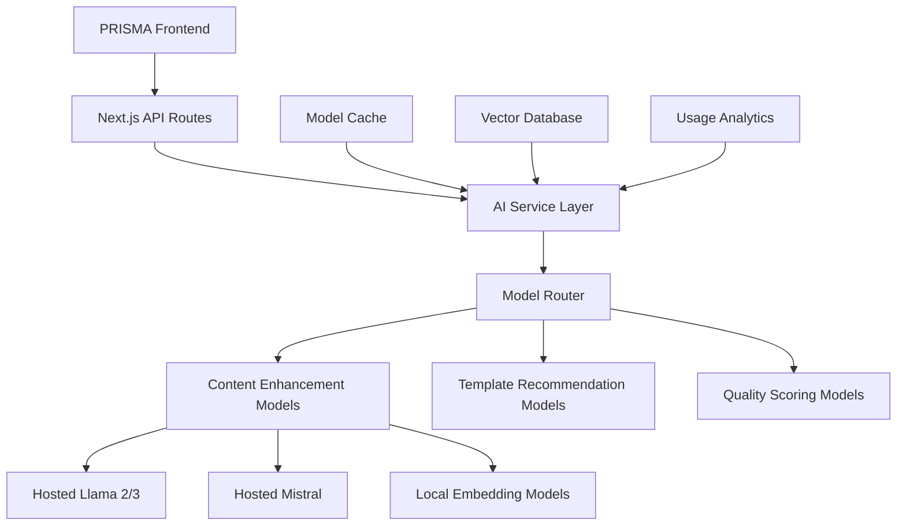

# PRISMA AI Architecture - Open Source Model Strategy

## 🎯 Strategic Overview

PRISMA leverages the best open-source AI models to provide content enhancement without the high costs and vendor lock-in of proprietary APIs. This approach prioritizes:

- **Cost Efficiency**: Pay only for inference/hosting, not per API call
- **Control**: Own the deployment and scaling decisions
- **Flexibility**: Easy model upgrades and A/B testing
- **Privacy**: User data stays within our infrastructure
- **Performance**: Optimized for portfolio-specific tasks

## 🏗️ Architecture Components

### 1. AI Model Infrastructure



### 2. Model Selection Strategy

#### Primary Models (Hosted Inference)

**Content Enhancement**
- **Llama 3.1 8B Instruct**: Bio rewriting, project descriptions
- **Mistral 7B Instruct**: Technical content optimization
- **CodeLlama 7B**: For developer portfolios (code explanations)

**Embeddings & Similarity**
- **Sentence-Transformers**: Content similarity and template matching
- **all-MiniLM-L6-v2**: Lightweight embeddings for content analysis

#### Hosting Options (Cost Analysis)

| Option | Cost/Month | Pros | Cons | Best For |
|--------|------------|------|------|----------|
| **Hugging Face Inference Endpoints** | $50-200 | Easy setup, auto-scaling | Limited customization | MVP/Testing |
| **Replicate** | $30-150 | Pay-per-use, multiple models | Higher per-inference cost | Variable workloads |
| **RunPod/Vast.ai** | $100-300 | Full control, GPU access | Requires DevOps | High volume |
| **Modal/Banana** | $80-250 | Serverless, auto-scaling | Cold start latency | Production |

**Recommended**: Start with **Hugging Face Inference Endpoints** for MVP, migrate to **Modal** for production scale.

### 3. API Architecture

```typescript
// Core AI Service Interface
interface AIService {
  enhanceBio(bio: string, context: BioContext): Promise<EnhancedContent>;
  optimizeProjectDescription(project: Project): Promise<EnhancedProject>;
  recommendTemplate(profile: UserProfile): Promise<TemplateRecommendation>;
  scoreContent(content: ContentPiece): Promise<QualityScore>;
}

// Model-specific implementations
class HuggingFaceService implements AIService {
  private endpoints: {
    llama3: string;
    mistral: string;
    embeddings: string;
  };
}

class ReplicateService implements AIService {
  private models: {
    contentEnhancement: string;
    templateRecommendation: string;
  };
}
```

### 4. Content Enhancement Pipeline

#### Bio Enhancement Flow
```
1. Input Validation & Sanitization
2. Context Extraction (skills, experience, industry)
3. Prompt Engineering with Few-Shot Examples
4. Model Inference (Llama 3.1 8B)
5. Content Quality Scoring
6. Fallback to Alternative Model if Quality < Threshold
7. Response Formatting & Safety Filtering
```

#### Project Description Optimization
```
1. Technical Content Analysis
2. STAR Format Detection (Situation, Task, Action, Result)
3. Metric Extraction (numbers, percentages, achievements)
4. Industry-Specific Enhancement (dev vs design vs business)
5. Length Optimization (target: 50-150 words)
```

## 🔧 Implementation Plan

### Phase 1: MVP Setup (Week 1-2)
- [ ] Hugging Face Inference Endpoints integration
- [ ] Basic bio enhancement with Llama 3.1 8B
- [ ] Simple prompt templates
- [ ] Error handling and fallbacks

### Phase 2: Enhanced Features (Week 3-4)
- [ ] Project description optimization
- [ ] Template recommendation system
- [ ] Content quality scoring
- [ ] Usage analytics and monitoring

### Phase 3: Production Optimization (Week 5-6)
- [ ] Model performance testing and optimization
- [ ] Caching layer implementation
- [ ] Rate limiting and usage controls
- [ ] Migration to production hosting (Modal/RunPod)

## 💰 Cost Projections

### Monthly AI Costs (Estimated)

**Hugging Face Endpoints (MVP)**
- Bio Enhancement: ~$0.02/request × 1000 requests = $20
- Project Optimization: ~$0.03/request × 500 requests = $15
- Template Recommendations: ~$0.01/request × 200 requests = $2
- **Total MVP**: ~$37/month

**Production Scale (10k users)**
- Bio Enhancement: ~$0.015/request × 10k = $150
- Project Optimization: ~$0.02/request × 5k = $100
- Quality Scoring: ~$0.005/request × 15k = $75
- **Total Production**: ~$325/month

**Cost Comparison vs OpenAI**
- OpenAI GPT-4: ~$0.30/request × 15k = $4,500/month
- **Savings**: ~$4,175/month (92% reduction)

## 🛡️ Security & Privacy

### Data Protection
- **No Data Retention**: Models process requests without storing user content
- **Local Processing**: Sensitive content can be processed on-premise
- **Anonymization**: Strip PII before model inference
- **Audit Trails**: Log usage without storing content

### Model Safety
- **Content Filtering**: Pre and post-processing filters
- **Bias Detection**: Regular model output evaluation
- **Fallback Systems**: Multiple model options for reliability
- **Human Review**: Quality sampling for continuous improvement

## 📊 Monitoring & Analytics

### Performance Metrics
- **Response Time**: Target <3 seconds per enhancement
- **Quality Score**: User satisfaction ratings
- **Model Accuracy**: A/B testing between models
- **Cost Per Enhancement**: Track ROI of different models

### Health Checks
- **Model Availability**: Endpoint monitoring
- **Response Quality**: Automated quality assessment
- **Error Rates**: Failed request tracking
- **Usage Patterns**: Peak time analysis

## 🔮 Future Enhancements

### Advanced Features
- **Custom Fine-tuning**: Industry-specific model variants
- **Multimodal AI**: Image processing for visual portfolios
- **Real-time Collaboration**: Live AI suggestions while editing
- **Personalization**: User-specific enhancement styles

### Model Upgrades
- **Llama 4**: When available, seamless upgrade path
- **Specialized Models**: Portfolio-specific fine-tuned models
- **Local Models**: On-device processing for premium users
- **Edge Deployment**: CDN-based model inference

## 🚀 Getting Started

### Environment Setup
```bash
# Required environment variables
HUGGINGFACE_API_KEY=hf_...
REPLICATE_API_TOKEN=r8_...
AI_MODEL_ENDPOINT=https://api-inference.huggingface.co/models/

# Optional: Production hosting
MODAL_TOKEN=...
RUNPOD_API_KEY=...
```

### Development Workflow
1. **Local Testing**: Use Hugging Face free tier for development
2. **Staging**: Deploy to HF Inference Endpoints
3. **Production**: Migrate to optimal hosting solution
4. **Monitoring**: Implement usage tracking and quality metrics

This architecture ensures PRISMA delivers powerful AI features while maintaining cost efficiency and user privacy. The open-source approach provides flexibility to adapt and improve as the AI landscape evolves.