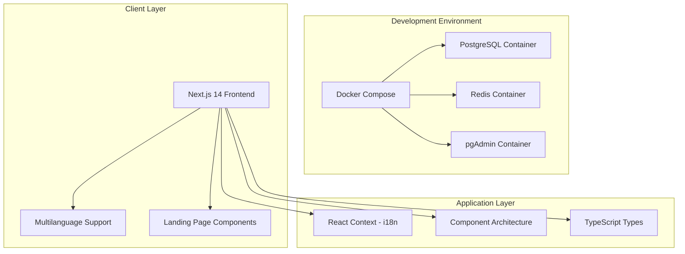
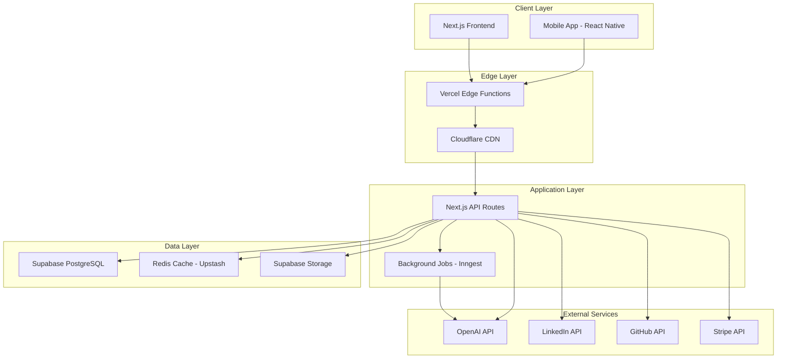
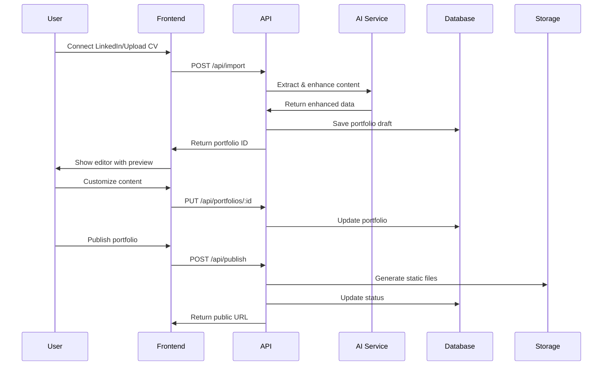
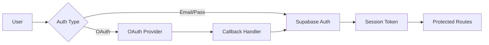

# MADFAM AI Portfolio Builder - Architecture Documentation

## 📐 System Architecture Overview

### Current Implementation (Foundation Phase)



### Target Architecture (SaaS Phase)



## 🏗️ Core Architecture Principles

### 1. **Separation of Concerns**

- Clear boundaries between presentation, business logic, and data layers
- Domain-driven design for core business logic
- Repository pattern for data access

### 2. **Scalability First**

- Stateless application design
- Horizontal scaling capability
- Edge computing for global performance

### 3. **Security by Design**

- Zero-trust architecture
- Principle of least privilege
- End-to-end encryption for sensitive data

### 4. **Developer Experience**

- Type-safe from database to frontend
- Consistent error handling
- Comprehensive logging and monitoring

## 🔧 Technical Stack Decisions

### Frontend Architecture

**Framework: Next.js 14 (App Router)** ✅ _Implemented_

- **Why**: Server Components for better performance, built-in optimization, excellent DX
- **Alternative considered**: Remix (rejected due to smaller ecosystem)
- **Current Status**: Landing page with multilanguage support complete

**Internationalization: React Context** ✅ _Implemented_

- **Why**: Simple, TypeScript-safe, no external dependencies for basic needs
- **Implementation**: Spanish (default) and English with localStorage persistence
- **Components**: All landing page components support i18n

**Styling: Tailwind CSS + React Icons** ✅ _Implemented_

- **Why**: Rapid development, consistent design system, zero runtime overhead
- **Implementation**: Responsive design with dark mode support
- **Icons**: Professional iconography with React Icons

**State Management: React Context (Current) → Zustand + React Query (Future)**

- **Current**: React Context for i18n state
- **Future**: Zustand for client state, React Query for server state
- **Alternative considered**: Redux Toolkit (rejected due to complexity for our needs)

### Backend Architecture

**Development Environment: Docker Compose** ✅ _Implemented_

- **Why**: Consistent development environment, all services included
- **Services**: PostgreSQL, Redis, pgAdmin for database management
- **Benefits**: One-command setup, isolated environment, production parity

**Database: PostgreSQL (Docker) → Supabase (Production)**

- **Current**: Local PostgreSQL in Docker for development
- **Future**: Supabase for real-time subscriptions, built-in auth, Row Level Security
- **Alternative considered**: Prisma + Planetscale (rejected due to lack of real-time)

**Caching: Redis (Docker) → Upstash (Production)**

- **Current**: Local Redis container for development
- **Future**: Upstash for serverless-friendly, pay-per-request, global replication
- **Alternative considered**: In-memory cache (rejected due to lack of persistence)

**File Storage: Local (Current) → Supabase Storage (Future)**

- **Future**: Integrated with auth, S3-compatible, CDN included
- **Alternative considered**: AWS S3 (rejected due to complexity)

### AI Integration Architecture

```typescript
// AI Service abstraction layer
interface AIProvider {
  generateBio(input: BioInput): Promise<BioOutput>;
  enhanceProject(input: ProjectInput): Promise<ProjectOutput>;
  suggestTemplate(input: ProfileData): Promise<TemplateRecommendation>;
}

class OpenAIProvider implements AIProvider {
  // Implementation
}

class ClaudeProvider implements AIProvider {
  // Implementation
}

// Factory pattern for provider selection
class AIServiceFactory {
  static getProvider(type: 'openai' | 'claude'): AIProvider {
    // Return appropriate provider
  }
}
```

## 📁 Current Project Structure

### ✅ Implemented Components

```
ai-portfolio-builder/
├── app/                          # Next.js App Router
│   ├── page.tsx                 # ✅ Landing page (multilanguage)
│   ├── layout.tsx               # ✅ Root layout with i18n provider
│   ├── globals.css              # ✅ Global styles
│   └── test/                    # ✅ Test page for debugging
├── components/                   # React components
│   ├── landing/                 # ✅ Landing page components
│   │   ├── Header.tsx           # ✅ Navigation with language toggle
│   │   ├── Hero.tsx             # ✅ Main hero section
│   │   ├── Features.tsx         # ✅ Features showcase
│   │   ├── HowItWorks.tsx       # ✅ Process explanation
│   │   ├── Templates.tsx        # ✅ Template previews
│   │   ├── Pricing.tsx          # ✅ Subscription tiers
│   │   ├── CTA.tsx              # ✅ Call-to-action section
│   │   ├── Footer.tsx           # ✅ Footer links
│   │   └── SocialProof.tsx      # ✅ Trust indicators
│   └── InteractiveScript.tsx    # ✅ Vanilla JS interactions
├── lib/                         # Core libraries
│   ├── i18n/                    # ✅ Internationalization
│   │   ├── simple-context.tsx   # ✅ React Context for i18n
│   │   ├── types.ts             # ✅ Translation types
│   │   └── translations.ts      # ✅ Spanish/English translations
│   ├── auth/                    # 🔄 Auth utilities (prepared)
│   └── utils/                   # ✅ Utility functions
├── __tests__/                   # ✅ Test files
│   ├── app/page.test.tsx        # ✅ Landing page tests
│   └── lib/auth/                # ✅ Auth tests (placeholder)
├── e2e/                         # ✅ End-to-end tests
├── scripts/                     # ✅ Build and utility scripts
│   ├── docker-dev.sh            # ✅ Docker development setup
│   └── setup-git.sh             # ✅ Git configuration
├── docs/                        # ✅ Project documentation
├── docker-compose.dev.yml       # ✅ Development environment
├── Dockerfile.dev               # ✅ Development container
└── Configuration files          # ✅ Next.js, TypeScript, ESLint, etc.
```

### 🎯 Future Structure (SaaS Phase)

```
ai-portfolio-builder/
├── app/
│   ├── (auth)/                  # 🔄 Authentication routes
│   ├── (dashboard)/             # 🔄 Protected dashboard routes
│   ├── (marketing)/             # 🔄 Public marketing pages
│   └── api/                     # 🔄 API routes
├── components/
│   ├── ui/                      # 🔄 Shadcn/ui components
│   ├── editor/                  # 🔄 Portfolio editor components
│   ├── templates/               # 🔄 Portfolio templates
│   └── shared/                  # 🔄 Shared components
├── lib/
│   ├── ai/                      # 🔄 AI service layer
│   ├── db/                      # 🔄 Database layer
│   └── auth/                    # 🔄 Authentication helpers
├── supabase/                    # 🔄 Database files
│   ├── migrations/              # 🔄 SQL migrations
│   └── functions/               # 🔄 Edge functions
└── types/                       # 🔄 TypeScript type definitions
```

Legend: ✅ Implemented | 🔄 Planned

## 🌍 Internationalization Architecture

### Current Implementation

```typescript
// lib/i18n/simple-context.tsx
interface LanguageContextType {
  language: Language;
  setLanguage: (lang: Language) => void;
  t: typeof translations.es;
  availableLanguages: { code: Language; name: string; flag: string }[];
}

// Language persistence and detection
const LanguageProvider = ({ children }) => {
  const [language, setLanguageState] = useState<Language>('es');

  useEffect(() => {
    // Load from localStorage
    const saved = localStorage.getItem('madfam-language');
    if (saved && (saved === 'es' || saved === 'en')) {
      setLanguageState(saved);
    }
  }, []);

  const setLanguage = (lang: Language) => {
    setLanguageState(lang);
    localStorage.setItem('madfam-language', lang);
    document.documentElement.lang = lang;
  };
};
```

### Features

- **Default Language**: Spanish (ES) 🇪🇸
- **Secondary Language**: English (EN) 🇺🇸
- **Persistence**: localStorage with fallback to default
- **SSR Compatibility**: Client-side hydration with 'use client' directives
- **Type Safety**: Full TypeScript support for translation keys

### Component Usage

```typescript
// Any landing page component
import { useLanguage } from '@/lib/i18n/simple-context';

export default function Component() {
  const { t, language, setLanguage } = useLanguage();

  return (
    <div>
      <h1>{t.heroTitle}</h1>
      <button onClick={() => setLanguage('en')}>
        Switch to English
      </button>
    </div>
  );
}
```

## 🔄 Data Flow Architecture

### 1. **Portfolio Generation Flow**



### 2. **Authentication Flow**



## 🗄️ Database Design

### Core Tables

```sql
-- Users table (managed by Supabase Auth)
-- Extended with profiles table

CREATE TABLE profiles (
    id UUID PRIMARY KEY REFERENCES auth.users(id),
    email TEXT UNIQUE NOT NULL,
    full_name TEXT,
    avatar_url TEXT,
    subscription_tier TEXT DEFAULT 'free',
    subscription_status TEXT DEFAULT 'active',
    stripe_customer_id TEXT,
    onboarding_completed BOOLEAN DEFAULT FALSE,
    created_at TIMESTAMP DEFAULT NOW(),
    updated_at TIMESTAMP DEFAULT NOW()
);

-- Portfolios table
CREATE TABLE portfolios (
    id UUID PRIMARY KEY DEFAULT gen_random_uuid(),
    user_id UUID REFERENCES profiles(id) ON DELETE CASCADE,
    slug TEXT UNIQUE NOT NULL,
    title TEXT,
    bio_raw TEXT,
    bio_processed TEXT,
    tagline TEXT,
    template_id TEXT NOT NULL,
    theme JSONB DEFAULT '{}',
    custom_domain TEXT,
    subdomain TEXT UNIQUE,
    meta_title TEXT,
    meta_description TEXT,
    published BOOLEAN DEFAULT FALSE,
    published_at TIMESTAMP,
    analytics_enabled BOOLEAN DEFAULT TRUE,
    created_at TIMESTAMP DEFAULT NOW(),
    updated_at TIMESTAMP DEFAULT NOW(),
    CONSTRAINT unique_custom_domain UNIQUE(custom_domain)
);

-- Projects table
CREATE TABLE projects (
    id UUID PRIMARY KEY DEFAULT gen_random_uuid(),
    portfolio_id UUID REFERENCES portfolios(id) ON DELETE CASCADE,
    title TEXT NOT NULL,
    description_raw TEXT,
    description_processed TEXT,
    technologies TEXT[],
    image_urls TEXT[],
    external_url TEXT,
    github_url TEXT,
    demo_url TEXT,
    start_date DATE,
    end_date DATE,
    display_order INTEGER DEFAULT 0,
    featured BOOLEAN DEFAULT FALSE,
    created_at TIMESTAMP DEFAULT NOW(),
    updated_at TIMESTAMP DEFAULT NOW()
);

-- Social links table
CREATE TABLE social_links (
    id UUID PRIMARY KEY DEFAULT gen_random_uuid(),
    portfolio_id UUID REFERENCES portfolios(id) ON DELETE CASCADE,
    platform TEXT NOT NULL,
    url TEXT NOT NULL,
    display_order INTEGER DEFAULT 0,
    created_at TIMESTAMP DEFAULT NOW()
);

-- Analytics events table
CREATE TABLE analytics_events (
    id UUID PRIMARY KEY DEFAULT gen_random_uuid(),
    portfolio_id UUID REFERENCES portfolios(id) ON DELETE CASCADE,
    event_type TEXT NOT NULL,
    visitor_id TEXT,
    referrer TEXT,
    user_agent TEXT,
    ip_country TEXT,
    created_at TIMESTAMP DEFAULT NOW()
);

-- Row Level Security policies
ALTER TABLE portfolios ENABLE ROW LEVEL SECURITY;
ALTER TABLE projects ENABLE ROW LEVEL SECURITY;
ALTER TABLE social_links ENABLE ROW LEVEL SECURITY;

-- Portfolios policies
CREATE POLICY "Users can view own portfolios" ON portfolios
    FOR SELECT USING (auth.uid() = user_id);

CREATE POLICY "Users can update own portfolios" ON portfolios
    FOR UPDATE USING (auth.uid() = user_id);

CREATE POLICY "Public can view published portfolios" ON portfolios
    FOR SELECT USING (published = true);
```

## 🔐 Security Architecture

### Authentication & Authorization

1. **Multi-layer Authentication**

   - Supabase Auth for primary authentication
   - JWT tokens with short expiry (15 minutes)
   - Refresh token rotation
   - OAuth 2.0 for social logins

2. **Authorization Model**

   ```typescript
   enum Permission {
     PORTFOLIO_CREATE = 'portfolio.create',
     PORTFOLIO_UPDATE = 'portfolio.update',
     PORTFOLIO_DELETE = 'portfolio.delete',
     PORTFOLIO_PUBLISH = 'portfolio.publish',
     BILLING_MANAGE = 'billing.manage',
   }

   interface Role {
     name: string;
     permissions: Permission[];
   }

   const roles: Record<string, Role> = {
     free: {
       name: 'Free User',
       permissions: [Permission.PORTFOLIO_CREATE, Permission.PORTFOLIO_UPDATE],
     },
     pro: {
       name: 'Pro User',
       permissions: [
         Permission.PORTFOLIO_CREATE,
         Permission.PORTFOLIO_UPDATE,
         Permission.PORTFOLIO_DELETE,
         Permission.PORTFOLIO_PUBLISH,
         Permission.BILLING_MANAGE,
       ],
     },
   };
   ```

### Data Security

1. **Encryption**

   - AES-256-GCM for sensitive data at rest
   - TLS 1.3 for data in transit
   - API keys encrypted in environment variables

2. **Input Validation**

   ```typescript
   import { z } from 'zod';

   const portfolioSchema = z.object({
     title: z.string().min(1).max(100),
     bio: z.string().max(1000),
     template_id: z.enum(['minimal', 'creative', 'professional']),
     projects: z.array(projectSchema).max(20),
   });

   // Validate all inputs
   function validatePortfolioInput(data: unknown) {
     return portfolioSchema.parse(data);
   }
   ```

## 🚀 Performance Optimization

### 1. **Caching Strategy**

```typescript
// Multi-tier caching
class CacheService {
  private memory: Map<string, CacheEntry> = new Map();
  private redis: Redis;

  async get<T>(key: string): Promise<T | null> {
    // L1: Memory cache
    const memoryHit = this.memory.get(key);
    if (memoryHit && !this.isExpired(memoryHit)) {
      return memoryHit.value;
    }

    // L2: Redis cache
    const redisHit = await this.redis.get(key);
    if (redisHit) {
      this.memory.set(key, { value: redisHit, expires: Date.now() + 60000 });
      return redisHit;
    }

    return null;
  }

  async set<T>(key: string, value: T, ttl: number): Promise<void> {
    // Set in both caches
    this.memory.set(key, { value, expires: Date.now() + ttl * 1000 });
    await this.redis.setex(key, ttl, JSON.stringify(value));
  }
}
```

### 2. **Database Optimization**

- Indexes on frequently queried columns
- Materialized views for complex queries
- Connection pooling with PgBouncer
- Query result caching

### 3. **Frontend Optimization**

- Server Components for initial render
- Suspense boundaries for progressive loading
- Image optimization with next/image
- Bundle splitting by route

## 🔍 Monitoring & Observability

### Logging Architecture

```typescript
// Structured logging
interface LogContext {
  userId?: string;
  portfolioId?: string;
  action: string;
  metadata?: Record<string, any>;
}

class Logger {
  info(message: string, context: LogContext) {
    console.log(
      JSON.stringify({
        level: 'info',
        message,
        timestamp: new Date().toISOString(),
        ...context,
      })
    );
  }

  error(message: string, error: Error, context: LogContext) {
    console.error(
      JSON.stringify({
        level: 'error',
        message,
        error: {
          name: error.name,
          message: error.message,
          stack: error.stack,
        },
        timestamp: new Date().toISOString(),
        ...context,
      })
    );
  }
}
```

### Metrics Collection

- **Application Metrics**: Response times, error rates, throughput
- **Business Metrics**: Conversion rates, feature usage, user engagement
- **Infrastructure Metrics**: CPU, memory, database connections

## 🔄 CI/CD Pipeline

```yaml
# GitHub Actions workflow
name: Deploy

on:
  push:
    branches: [main]
  pull_request:
    branches: [main]

jobs:
  test:
    runs-on: ubuntu-latest
    steps:
      - uses: actions/checkout@v3
      - uses: pnpm/action-setup@v2
      - uses: actions/setup-node@v3
      - run: pnpm install
      - run: pnpm test
      - run: pnpm type-check
      - run: pnpm lint

  deploy:
    needs: test
    if: github.ref == 'refs/heads/main'
    runs-on: ubuntu-latest
    steps:
      - uses: actions/checkout@v3
      - uses: vercel/action@v3
        with:
          vercel-token: ${{ secrets.VERCEL_TOKEN }}
```

## 🎯 Future Architecture Considerations

### 1. **Microservices Migration** (Year 2)

- Extract AI service as standalone microservice
- Separate portfolio rendering service
- Independent analytics service

### 2. **Multi-Region Deployment** (Year 2)

- Database replication across regions
- Edge computing for portfolio serving
- Regional AI model deployment

### 3. **Event-Driven Architecture** (Year 3)

- Event sourcing for portfolio changes
- CQRS for read/write separation
- Real-time collaboration features

---

This architecture is designed to scale from MVP to millions of users while maintaining code quality, performance, and developer experience.
