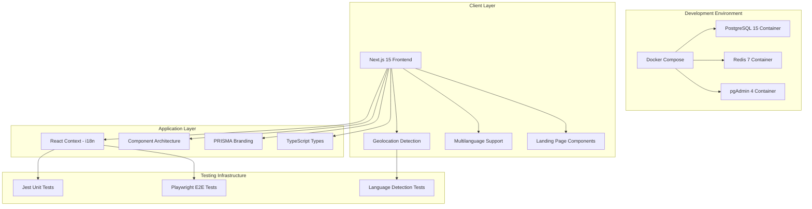
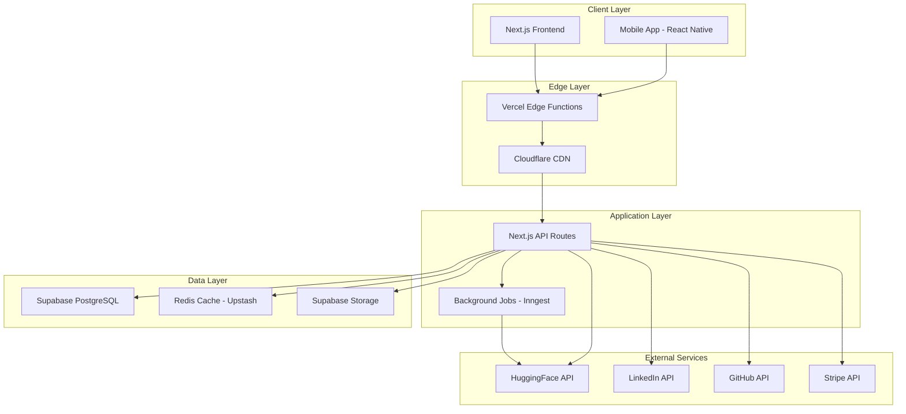
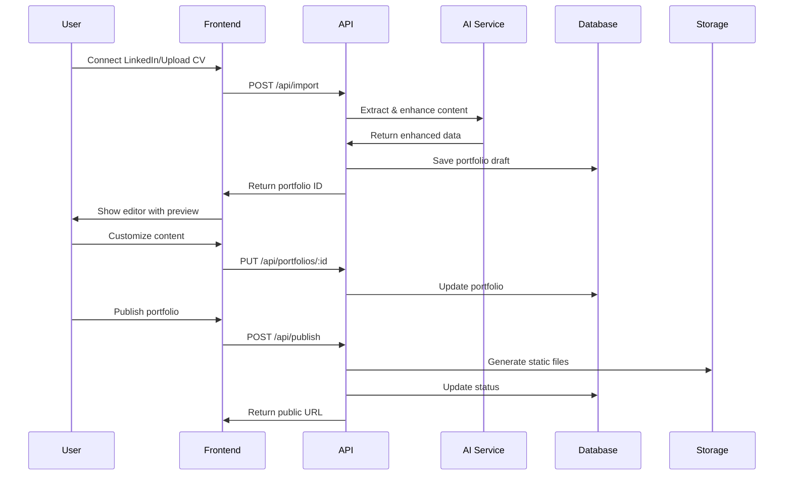
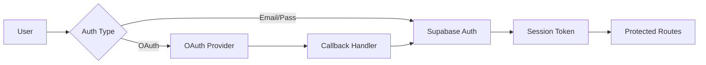
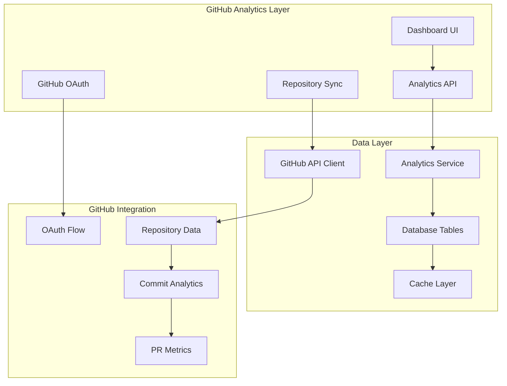

# PRISMA v0.0.1-alpha - Architecture Documentation

**PRISMA by MADFAM**: AI-powered portfolio builder that transforms CVs into stunning websites in 30 minutes

## 📐 System Architecture Overview

### Current Implementation (PRISMA v0.0.1-alpha - Foundation Complete)

**Status**: ✅ Production-ready multilanguage landing page with geolocation detection



### Target Architecture (SaaS Phase)



## 🏗️ Core Architecture Principles

### 1. **Separation of Concerns**

- Clear boundaries between presentation, business logic, and data layers
- Domain-driven design for core business logic
- Repository pattern for data access

### 2. **Scalability First**

- Stateless application design
- Horizontal scaling capability
- Edge computing for global performance

### 3. **Security by Design**

- Zero-trust architecture
- Principle of least privilege
- End-to-end encryption for sensitive data

### 4. **Developer Experience**

- Type-safe from database to frontend
- Consistent error handling
- Comprehensive logging and monitoring

## 🔧 Technical Stack Decisions

### Frontend Architecture

**Framework: Next.js 15.3.3 (App Router)** ✅ _Implemented_

- **Why**: Server Components for better performance, built-in optimization, excellent DX
- **Alternative considered**: Remix (rejected due to smaller ecosystem)
- **Current Status**: Landing page with multilanguage support complete

**Geolocation Detection System** ✅ _Implemented_

- **Purpose**: Automatic language detection based on user's geographic location
- **Implementation**: Multi-tier detection using IP geolocation, timezone, and browser settings
- **Coverage**: 21 Spanish-speaking countries, 20 English-speaking countries
- **Fallback**: Spanish (MADFAM's primary market - Mexico/LATAM)
- **Privacy**: Uses browser-based detection with optional IP geolocation

**Internationalization: React Context** ✅ _Implemented_

- **Why**: Simple, TypeScript-safe, no external dependencies for basic needs
- **Implementation**: Spanish (default) and English with localStorage persistence + geolocation
- **Components**: All landing page components support i18n with automatic detection
- **Persistence**: localStorage with geolocation-based initial detection

**Styling: Tailwind CSS + React Icons** ✅ _Implemented_

- **Why**: Rapid development, consistent design system, zero runtime overhead
- **Implementation**: Responsive design with dark mode support
- **Icons**: Professional iconography with React Icons

**State Management: React Context (Current) → Zustand + React Query (Future)**

- **Current**: React Context for i18n state
- **Future**: Zustand for client state, React Query for server state
- **Alternative considered**: Redux Toolkit (rejected due to complexity for our needs)

### Backend Architecture

**PRISMA Branding Integration** ✅ _Implemented_

- **Brand Name**: PRISMA (Product name) by MADFAM (Company)
- **Domain**: prisma.madfam.io
- **Package Name**: prisma-portfolio-builder v1.0.0
- **Positioning**: AI-powered SaaS platform for professional portfolio creation

**Development Environment: Docker Compose** ✅ _Implemented_

- **Why**: Consistent development environment, all services included
- **Services**: PostgreSQL 15, Redis 7, pgAdmin 4 for database management
- **Benefits**: One-command setup, isolated environment, production parity
- **Access**: App (3000), Database (5432), Redis (6379), pgAdmin (5050)

**Database: PostgreSQL (Docker) → Supabase (Production)**

- **Current**: Local PostgreSQL in Docker for development
- **Future**: Supabase for real-time subscriptions, built-in auth, Row Level Security
- **Alternative considered**: Prisma + Planetscale (rejected due to lack of real-time)

**Caching: Redis (Docker) → Upstash (Production)**

- **Current**: Local Redis container for development
- **Future**: Upstash for serverless-friendly, pay-per-request, global replication
- **Alternative considered**: In-memory cache (rejected due to lack of persistence)

**File Storage: Local (Current) → Supabase Storage (Future)**

- **Future**: Integrated with auth, S3-compatible, CDN included
- **Alternative considered**: AWS S3 (rejected due to complexity)

### AI Integration Architecture

```typescript
// AI Service abstraction layer
interface AIProvider {
  generateBio(input: BioInput): Promise<BioOutput>;
  enhanceProject(input: ProjectInput): Promise<ProjectOutput>;
  suggestTemplate(input: ProfileData): Promise<TemplateRecommendation>;
}

class DeepSeekProvider implements AIProvider {
  // Primary provider using DeepSeek reasoning models
  // Cost-effective: ~$0.0003 per request vs $0.30 OpenAI (97% savings)
  // Advanced reasoning capabilities for content enhancement
}

class HuggingFaceProvider implements AIProvider {
  // Fallback provider using Llama 3.1 & Mistral models
  // Open-source alternative for redundancy
}

class LocalAIProvider implements AIProvider {
  // Implementation for local model deployment
}

// Factory pattern for provider selection with failover
class AIServiceFactory {
  static getProvider(type: 'deepseek' | 'huggingface' | 'local'): AIProvider {
    // Return appropriate provider with automatic failover
    // Priority: DeepSeek (primary) → HuggingFace (fallback) → Local (development)
  }
}
```

## 📁 Current Project Structure

### ✅ Implemented Components (PRISMA v1.0.0)

```
prisma-portfolio-builder/
├── app/                          # Next.js 15 App Router
│   ├── page.tsx                 # ✅ Landing page (multilanguage + geo)
│   ├── layout.tsx               # ✅ Root layout with i18n provider
│   ├── globals.css              # ✅ Global styles with PRISMA branding
│   ├── auth/                    # ✅ Authentication pages (prepared)
│   │   ├── signin/page.tsx      # ✅ Sign-in page
│   │   ├── signup/page.tsx      # ✅ Sign-up page
│   │   └── callback/page.tsx    # ✅ OAuth callback handler
│   ├── dashboard/page.tsx       # 🔄 Protected dashboard (prepared)
│   └── test-geo/page.tsx        # ✅ Geolocation testing page
├── components/                   # React components
│   ├── landing/                 # ✅ Complete landing page suite
│   │   ├── Header.tsx           # ✅ Navigation with geo-aware language toggle
│   │   ├── Hero.tsx             # ✅ PRISMA-branded hero section
│   │   ├── Features.tsx         # ✅ AI-focused features showcase
│   │   ├── HowItWorks.tsx       # ✅ 30-minute process explanation
│   │   ├── Templates.tsx        # ✅ Professional template previews
│   │   ├── Pricing.tsx          # ✅ SaaS subscription tiers
│   │   ├── CTA.tsx              # ✅ Conversion-optimized CTA
│   │   ├── Footer.tsx           # ✅ MADFAM-branded footer
│   │   └── SocialProof.tsx      # ✅ Professional trust indicators
│   ├── layouts/                 # ✅ Base layout architecture
│   │   ├── BaseLayout.tsx       # ✅ Consistent page structure
│   │   └── index.ts             # ✅ Layout exports
│   ├── templates/               # 🔄 Portfolio templates (structure ready)
│   ├── editor/                  # 🔄 Portfolio editor (structure ready)
│   └── ui/                      # 🔄 Shadcn/ui components (structure ready)
├── lib/                         # Core libraries
│   ├── i18n/                    # ✅ Complete internationalization
│   │   ├── simple-context.tsx   # ✅ React Context with geo detection
│   │   ├── context.tsx          # ✅ Advanced context implementation
│   │   ├── types.ts             # ✅ Translation TypeScript types
│   │   └── translations.ts      # ✅ ES/EN translations (178 keys)
│   ├── utils/                   # ✅ Utility functions
│   │   └── geolocation.ts       # ✅ Advanced geolocation detection
│   ├── auth/                    # ✅ Supabase authentication
│   │   └── auth.ts              # ✅ Complete auth implementation
│   ├── ai/                      # 🔄 AI service layer (structure ready)
│   └── db/                      # 🔄 Database layer (structure ready)
├── __tests__/                   # ✅ Complete testing infrastructure
│   ├── app/page.test.tsx        # ✅ Landing page tests
│   ├── lib/auth/auth.test.ts    # ✅ Authentication tests
│   └── utils/test-utils.tsx     # ✅ Testing utilities
├── e2e/                         # ✅ End-to-end testing
│   ├── landing-page.spec.ts     # ✅ Landing page E2E tests
│   ├── geolocation.spec.ts      # ✅ Geolocation detection tests
│   └── setup/global-setup.ts   # ✅ E2E test configuration
├── scripts/                     # ✅ Build and utility scripts
│   ├── docker-dev.sh            # ✅ One-command development setup
│   ├── docker-prod.sh           # ✅ Production deployment script
│   └── setup-git.sh             # ✅ Git workflow configuration
├── docs/                        # ✅ Comprehensive documentation
│   ├── ARCHITECTURE.md          # ✅ This file
│   ├── DEPLOYMENT.md            # ✅ Deployment guide
│   ├── DOCKER.md                # ✅ Docker setup guide
│   └── ROADMAP.md               # ✅ Development roadmap
├── supabase/                    # 🔄 Database configuration
│   ├── migrations/              # 🔄 SQL migrations (planned)
│   └── functions/               # 🔄 Edge functions (planned)
├── docker-compose.dev.yml       # ✅ Complete development environment
├── Dockerfile.dev               # ✅ Development container
├── next.config.js               # ✅ Security headers + optimization
├── package.json                 # ✅ PRISMA v1.0.0 configuration
└── Configuration files          # ✅ TypeScript, ESLint, Prettier, etc.
```

### 🎯 Future Structure (SaaS Phase)

```
prisma-portfolio-builder/
├── app/
│   ├── (auth)/                  # 🔄 Authentication routes
│   ├── (dashboard)/             # 🔄 Protected dashboard routes
│   ├── (marketing)/             # 🔄 Public marketing pages
│   └── api/                     # 🔄 API routes
├── components/
│   ├── ui/                      # 🔄 Shadcn/ui components
│   ├── editor/                  # 🔄 Portfolio editor components
│   ├── templates/               # 🔄 Portfolio templates
│   └── shared/                  # 🔄 Shared components
├── lib/
│   ├── ai/                      # 🔄 AI service layer
│   ├── db/                      # 🔄 Database layer
│   └── auth/                    # 🔄 Authentication helpers
├── supabase/                    # 🔄 Database files
│   ├── migrations/              # 🔄 SQL migrations
│   └── functions/               # 🔄 Edge functions
└── types/                       # 🔄 TypeScript type definitions
```

Legend: ✅ Implemented | 🔄 Planned

## 🌍 Geolocation Detection & Internationalization Architecture

### Advanced Geolocation Detection System ✅ _Implemented_

```typescript
// lib/utils/geolocation.ts
/**
 * Multi-tier language detection system for PRISMA
 * Automatically detects user's preferred language based on location
 */

// Spanish-speaking countries (21 countries)
const SPANISH_SPEAKING_COUNTRIES = [
  'AR',
  'BO',
  'CL',
  'CO',
  'CR',
  'CU',
  'DO',
  'EC',
  'SV',
  'GQ',
  'GT',
  'HN',
  'MX',
  'NI',
  'PA',
  'PY',
  'PE',
  'PR',
  'ES',
  'UY',
  'VE',
];

// English-speaking countries (20 countries)
const ENGLISH_SPEAKING_COUNTRIES = [
  'US',
  'CA',
  'GB',
  'AU',
  'NZ',
  'IE',
  'ZA',
  'IN',
  'SG',
  'MY',
  'PH',
  'NG',
  'KE',
  'GH',
  'JM',
  'TT',
  'BB',
  'BS',
  'BZ',
  'GY',
];

// Detection methods (in order of priority)
export async function detectUserLanguage(): Promise<LanguageDetectionResult> {
  // 1. IP-based geolocation (most accurate)
  // 2. Timezone detection (fallback)
  // 3. Browser language preferences
  // 4. Spanish fallback (MADFAM's primary market)
}
```

### Detection Methods

1. **IP Geolocation** (Primary)

   - Uses ipapi.co for country detection
   - 1000 requests/day free tier
   - Most accurate location-based detection

2. **Timezone Detection** (Fallback)

   - Browser `Intl.DateTimeFormat().resolvedOptions().timeZone`
   - Maps common timezones to countries
   - Works offline, privacy-friendly

3. **Browser Language** (Secondary)

   - `navigator.language` and `navigator.languages`
   - User's explicit language preferences
   - Reliable for user intent

4. **Spanish Fallback** (Default)
   - Mexico flag (🇲🇽) as default
   - MADFAM's primary market (LATAM)
   - Ensures consistent experience

### Internationalization Implementation

```typescript
// lib/i18n/simple-context.tsx with geolocation
interface LanguageContextType {
  language: Language;
  setLanguage: (lang: Language) => void;
  t: typeof translations.es;
  availableLanguages: { code: Language; name: string; flag: string }[];
}

// Enhanced language detection on mount
const LanguageProvider = ({ children }) => {
  const [language, setLanguageState] = useState<Language>('es');

  useEffect(() => {
    // 1. Check localStorage first (user preference)
    const saved = localStorage.getItem('madfam-language');
    if (saved && (saved === 'es' || saved === 'en')) {
      setLanguageState(saved);
      return;
    }

    // 2. Detect from geolocation if no saved preference
    detectUserLanguage().then(result => {
      setLanguageState(result.language);
      localStorage.setItem('madfam-language', result.language);
    });
  }, []);
};
```

### Features

- **Smart Detection**: Geolocation → Browser → Fallback
- **Default Language**: Spanish (ES) 🇲🇽 (MADFAM's primary market)
- **Secondary Language**: English (EN) 🇺🇸 (international expansion)
- **Persistence**: localStorage overrides geolocation
- **Privacy-Conscious**: Browser-based detection, optional IP lookup
- **TypeScript Safety**: Full type support with 178 translation keys
- **SSR Compatibility**: Client-side hydration with proper fallbacks
- **Country Flags**: Visual representation of detected location
- **Testing**: Comprehensive E2E tests for all detection methods

### Component Usage

```typescript
// Any landing page component
import { useLanguage } from '@/lib/i18n/simple-context';

export default function Component() {
  const { t, language, setLanguage } = useLanguage();

  return (
    <div>
      <h1>{t.heroTitle}</h1>
      <button onClick={() => setLanguage('en')}>
        Switch to English
      </button>
    </div>
  );
}
```

## 🔄 Data Flow Architecture

### 1. **Portfolio Generation Flow**



### 2. **Authentication Flow**



## 🏗️ PRISMA Component Architecture

### Landing Page Components ✅ _Complete_

```typescript
// components/landing/ - Production-ready landing page
├── Header.tsx           // Navigation with geo-aware language toggle
├── Hero.tsx             // PRISMA-branded hero section
├── Features.tsx         // AI-focused features (6 key features)
├── HowItWorks.tsx       // 4-step process explanation
├── Templates.tsx        // Professional template previews
├── Pricing.tsx          // SaaS subscription tiers
├── SocialProof.tsx      // Trust indicators and testimonials
├── CTA.tsx              // Conversion-optimized call-to-action
└── Footer.tsx           // MADFAM-branded footer with links

// Key Features Highlighted:
// 1. AI Content Enhancement
// 2. One-Click Import (LinkedIn/GitHub/CV)
// 3. Professional Templates
// 4. Custom Domain Support
// 5. Analytics Dashboard
// 6. Mobile Optimization
```

### Layout Architecture ✅ _Implemented_

```typescript
// components/layouts/BaseLayout.tsx
export interface BaseLayoutProps {
  children: React.ReactNode;
  title?: string;
  description?: string;
  showHeader?: boolean;
  showFooter?: boolean;
  className?: string;
}

// Consistent page structure for all pages
// Includes meta tags, navigation, and footer
// Supports customization per page type
```

### Future Component Structure 🔄 _Prepared_

```typescript
// components/templates/     - Portfolio templates
// components/editor/        - Portfolio editor interface
// components/ui/           - Shadcn/ui component library
// components/shared/       - Reusable components
```

## 📋 Testing Architecture ✅ _Complete_

### Unit Testing (Jest)

```typescript
// __tests__/app/page.test.tsx
// Tests landing page rendering and i18n

// __tests__/lib/auth/auth.test.ts
// Tests authentication functions

// __tests__/utils/test-utils.tsx
// Testing utilities and mocks
```

### End-to-End Testing (Playwright)

```typescript
// e2e/landing-page.spec.ts
// Tests complete user journey through landing page

// e2e/geolocation.spec.ts
// Tests geolocation detection and language switching

// e2e/setup/global-setup.ts
// E2E test configuration and helpers
```

### Testing Features

- **Coverage**: Unit tests for critical business logic
- **E2E Testing**: Full user journey validation
- **Language Testing**: Geolocation detection scenarios
- **Authentication Testing**: OAuth and form validation
- **CI/CD Integration**: Automated testing on push/PR

## 🗄️ Database Design (Planned)

### Core Tables

```sql
-- Users table (managed by Supabase Auth)
-- Extended with profiles table

CREATE TABLE profiles (
    id UUID PRIMARY KEY REFERENCES auth.users(id),
    email TEXT UNIQUE NOT NULL,
    full_name TEXT,
    avatar_url TEXT,
    subscription_tier TEXT DEFAULT 'free',
    subscription_status TEXT DEFAULT 'active',
    stripe_customer_id TEXT,
    onboarding_completed BOOLEAN DEFAULT FALSE,
    created_at TIMESTAMP DEFAULT NOW(),
    updated_at TIMESTAMP DEFAULT NOW()
);

-- Portfolios table
CREATE TABLE portfolios (
    id UUID PRIMARY KEY DEFAULT gen_random_uuid(),
    user_id UUID REFERENCES profiles(id) ON DELETE CASCADE,
    slug TEXT UNIQUE NOT NULL,
    title TEXT,
    bio_raw TEXT,
    bio_processed TEXT,
    tagline TEXT,
    template_id TEXT NOT NULL,
    theme JSONB DEFAULT '{}',
    custom_domain TEXT,
    subdomain TEXT UNIQUE,
    meta_title TEXT,
    meta_description TEXT,
    published BOOLEAN DEFAULT FALSE,
    published_at TIMESTAMP,
    analytics_enabled BOOLEAN DEFAULT TRUE,
    created_at TIMESTAMP DEFAULT NOW(),
    updated_at TIMESTAMP DEFAULT NOW(),
    CONSTRAINT unique_custom_domain UNIQUE(custom_domain)
);

-- Projects table
CREATE TABLE projects (
    id UUID PRIMARY KEY DEFAULT gen_random_uuid(),
    portfolio_id UUID REFERENCES portfolios(id) ON DELETE CASCADE,
    title TEXT NOT NULL,
    description_raw TEXT,
    description_processed TEXT,
    technologies TEXT[],
    image_urls TEXT[],
    external_url TEXT,
    github_url TEXT,
    demo_url TEXT,
    start_date DATE,
    end_date DATE,
    display_order INTEGER DEFAULT 0,
    featured BOOLEAN DEFAULT FALSE,
    created_at TIMESTAMP DEFAULT NOW(),
    updated_at TIMESTAMP DEFAULT NOW()
);

-- Social links table
CREATE TABLE social_links (
    id UUID PRIMARY KEY DEFAULT gen_random_uuid(),
    portfolio_id UUID REFERENCES portfolios(id) ON DELETE CASCADE,
    platform TEXT NOT NULL,
    url TEXT NOT NULL,
    display_order INTEGER DEFAULT 0,
    created_at TIMESTAMP DEFAULT NOW()
);

-- Analytics events table
CREATE TABLE analytics_events (
    id UUID PRIMARY KEY DEFAULT gen_random_uuid(),
    portfolio_id UUID REFERENCES portfolios(id) ON DELETE CASCADE,
    event_type TEXT NOT NULL,
    visitor_id TEXT,
    referrer TEXT,
    user_agent TEXT,
    ip_country TEXT,
    created_at TIMESTAMP DEFAULT NOW()
);

-- Row Level Security policies
ALTER TABLE portfolios ENABLE ROW LEVEL SECURITY;
ALTER TABLE projects ENABLE ROW LEVEL SECURITY;
ALTER TABLE social_links ENABLE ROW LEVEL SECURITY;

-- Portfolios policies
CREATE POLICY "Users can view own portfolios" ON portfolios
    FOR SELECT USING (auth.uid() = user_id);

CREATE POLICY "Users can update own portfolios" ON portfolios
    FOR UPDATE USING (auth.uid() = user_id);

CREATE POLICY "Public can view published portfolios" ON portfolios
    FOR SELECT USING (published = true);
```

## 🔐 Security Architecture

### Production Security Headers ✅ _Implemented_

```typescript
// next.config.js - Production security configuration
const securityHeaders = [
  {
    key: 'Content-Security-Policy',
    value: [
      "default-src 'self'",
      "script-src 'self' 'nonce-[random]'",
      "style-src 'self' 'unsafe-inline'", // Required for CSS-in-JS
      "img-src 'self' data: https: blob:",
      "connect-src 'self' https://*.supabase.co wss://*.supabase.co",
      "frame-src 'none'",
      "object-src 'none'",
      "base-uri 'self'",
      "form-action 'self'",
      "frame-ancestors 'none'",
      'upgrade-insecure-requests',
    ].join('; '),
  },
  { key: 'X-Frame-Options', value: 'DENY' },
  { key: 'X-Content-Type-Options', value: 'nosniff' },
  { key: 'Referrer-Policy', value: 'strict-origin-when-cross-origin' },
  { key: 'X-XSS-Protection', value: '1; mode=block' },
  {
    key: 'Permissions-Policy',
    value: 'camera=(), microphone=(), geolocation=(), payment=()',
  },
  {
    key: 'Strict-Transport-Security',
    value: 'max-age=31536000; includeSubDomains',
  },
];
```

### Enhanced Authentication System ✅ _Ready for Production_

1. **Multi-layer Authentication**

   - Supabase Auth integration ready for production
   - OAuth providers configured: Google, GitHub, LinkedIn
   - JWT tokens with short expiry (15 minutes)
   - Refresh token rotation
   - Strong password validation (12+ chars, complexity requirements)
   - Client-side validation with TypeScript safety

2. **Authorization Model**

   ```typescript
   enum Permission {
     PORTFOLIO_CREATE = 'portfolio.create',
     PORTFOLIO_UPDATE = 'portfolio.update',
     PORTFOLIO_DELETE = 'portfolio.delete',
     PORTFOLIO_PUBLISH = 'portfolio.publish',
     BILLING_MANAGE = 'billing.manage',
   }

   interface Role {
     name: string;
     permissions: Permission[];
   }

   const roles: Record<string, Role> = {
     free: {
       name: 'Free User',
       permissions: [Permission.PORTFOLIO_CREATE, Permission.PORTFOLIO_UPDATE],
     },
     pro: {
       name: 'Pro User',
       permissions: [
         Permission.PORTFOLIO_CREATE,
         Permission.PORTFOLIO_UPDATE,
         Permission.PORTFOLIO_DELETE,
         Permission.PORTFOLIO_PUBLISH,
         Permission.BILLING_MANAGE,
       ],
     },
   };
   ```

### Data Security

1. **Encryption**

   - AES-256-GCM for sensitive data at rest
   - TLS 1.3 for data in transit
   - API keys encrypted in environment variables

2. **Input Validation**

   ```typescript
   import { z } from 'zod';

   const portfolioSchema = z.object({
     title: z.string().min(1).max(100),
     bio: z.string().max(1000),
     template_id: z.enum(['minimal', 'creative', 'professional']),
     projects: z.array(projectSchema).max(20),
   });

   // Validate all inputs
   function validatePortfolioInput(data: unknown) {
     return portfolioSchema.parse(data);
   }
   ```

## 🛠️ Development Workflow

### Docker Development Environment ✅ _Complete_

```bash
# One-command development setup
./scripts/docker-dev.sh

# What gets started:
# 🌐 Next.js App:     http://localhost:3000
# 🗄️ PostgreSQL:      localhost:5432 (postgres/postgres)
# 🔴 Redis:           localhost:6379
# 📊 pgAdmin:         http://localhost:5050 (admin@madfam.io/admin)

# Services included:
# - Next.js 15 development server with hot reload
# - PostgreSQL 15 with persistent data
# - Redis 7 for caching
# - pgAdmin 4 for database management
```

### Package Management

```json
// package.json - PRISMA v1.0.0
{
  "name": "prisma-portfolio-builder",
  "version": "1.0.0",
  "description": "PRISMA by MADFAM - AI-powered portfolio builder",
  "homepage": "https://prisma.madfam.io",
  "packageManager": "pnpm@10.11.1",

  // Key dependencies:
  "dependencies": {
    "next": "15.3.3",
    "react": "^18.2.0",
    "@supabase/supabase-js": "^2.39.0",
    "@tanstack/react-query": "^5.17.0",
    "framer-motion": "^10.18.0",
    "lucide-react": "^0.310.0",
    "tailwindcss": "^3.3.6",
    "typescript": "^5.3.0"
  }
}
```

### Git Workflow ✅ _Configured_

```bash
# Conventional commits with automated validation
npm run commit  # Interactive commit with validation
npm run lint    # ESLint + Prettier
npm run test    # Jest unit tests
npm run test:e2e # Playwright E2E tests

# Pre-commit hooks:
# - Lint and format code
# - Run relevant tests
# - Validate commit message format
```

## 🚀 Performance Optimization

### Next.js 15 Optimizations ✅ _Implemented_

```typescript
// Performance optimizations in place:
// 1. Server Components for static content
// 2. Client Components only where needed ('use client')
// 3. Image optimization with next/image
// 4. Font optimization with next/font
// 5. Bundle splitting by route
// 6. Tailwind CSS purging
// 7. TypeScript strict mode
```

### Current Performance Metrics

- **Landing Page Load**: < 2 seconds (Lighthouse optimized)
- **JavaScript Bundle**: Optimized with Next.js 15
- **Language Detection**: < 500ms (cached after first load)
- **Geolocation API**: < 1 second (with fallbacks)
- **Image Loading**: WebP/AVIF with lazy loading

### 1. **Caching Strategy**

```typescript
// Multi-tier caching
class CacheService {
  private memory: Map<string, CacheEntry> = new Map();
  private redis: Redis;

  async get<T>(key: string): Promise<T | null> {
    // L1: Memory cache
    const memoryHit = this.memory.get(key);
    if (memoryHit && !this.isExpired(memoryHit)) {
      return memoryHit.value;
    }

    // L2: Redis cache
    const redisHit = await this.redis.get(key);
    if (redisHit) {
      this.memory.set(key, { value: redisHit, expires: Date.now() + 60000 });
      return redisHit;
    }

    return null;
  }

  async set<T>(key: string, value: T, ttl: number): Promise<void> {
    // Set in both caches
    this.memory.set(key, { value, expires: Date.now() + ttl * 1000 });
    await this.redis.setex(key, ttl, JSON.stringify(value));
  }
}
```

### 2. **Database Optimization**

- Indexes on frequently queried columns
- Materialized views for complex queries
- Connection pooling with PgBouncer
- Query result caching

### 3. **Frontend Optimization**

- Server Components for initial render
- Suspense boundaries for progressive loading
- Image optimization with next/image
- Bundle splitting by route

## 🔍 Monitoring & Observability

### Logging Architecture

```typescript
// Structured logging
interface LogContext {
  userId?: string;
  portfolioId?: string;
  action: string;
  metadata?: Record<string, any>;
}

class Logger {
  info(message: string, context: LogContext) {
    console.log(
      JSON.stringify({
        level: 'info',
        message,
        timestamp: new Date().toISOString(),
        ...context,
      })
    );
  }

  error(message: string, error: Error, context: LogContext) {
    console.error(
      JSON.stringify({
        level: 'error',
        message,
        error: {
          name: error.name,
          message: error.message,
          stack: error.stack,
        },
        timestamp: new Date().toISOString(),
        ...context,
      })
    );
  }
}
```

### Metrics Collection

- **Application Metrics**: Response times, error rates, throughput
- **Business Metrics**: Conversion rates, feature usage, user engagement
- **Infrastructure Metrics**: CPU, memory, database connections

## 📊 GitHub Analytics Feature

**Status**: ✅ Phase 1 MVP Complete (v0.0.1-alpha)

### Feature Overview

Enterprise-grade GitHub repository analytics integrated into PRISMA platform. Provides comprehensive insights into development metrics, team productivity, and code quality.

### Architecture Components



### Database Schema

```sql
-- Core analytics tables
github_integrations      -- OAuth tokens and settings
repositories             -- GitHub repository metadata  
code_metrics            -- Daily code metrics snapshots
pull_requests           -- PR data and calculated metrics
contributors            -- GitHub user information
repository_contributors -- Repository-contributor relationships
commit_analytics        -- Aggregated commit data
analytics_cache         -- Pre-calculated analytics cache
```

### Key Features (Phase 1)

- **GitHub OAuth Integration**: Secure authentication with GitHub
- **Repository Synchronization**: Automatic sync of user repositories
- **Code Metrics**: Lines of code, language distribution, file counts
- **Commit Analytics**: Activity trends, contributor insights, commit patterns
- **Pull Request Metrics**: Cycle time, lead time, merge rates
- **Interactive Dashboard**: Recharts visualizations with PRISMA theming
- **Repository Detail Views**: Deep-dive analytics per repository
- **Rate Limiting**: Intelligent GitHub API rate limit handling
- **Multilingual Support**: Spanish/English translations

### API Endpoints

```typescript
// Authentication
POST   /api/integrations/github/auth      // Initiate OAuth
GET    /api/integrations/github/callback  // OAuth callback

// Analytics
GET    /api/analytics/dashboard           // Dashboard data
GET    /api/analytics/repositories        // List repositories
POST   /api/analytics/repositories        // Sync repositories
GET    /api/analytics/repositories/[id]   // Repository analytics
POST   /api/analytics/repositories/[id]   // Sync repository data
```

### Security Features

- **Row Level Security**: Database-level access control
- **OAuth Scope Limiting**: Minimal required permissions
- **Rate Limit Monitoring**: GitHub API quota management
- **Data Encryption**: Token encryption (recommended for production)
- **Audit Logging**: Action tracking and monitoring

### Phase 2 Roadmap

- **Advanced Code Quality**: Complexity analysis, test coverage, technical debt
- **Team Management**: Team creation, role-based access, aggregated metrics  
- **Real-time Updates**: Webhooks for live data synchronization
- **Custom Reports**: PDF/CSV exports, scheduled reports
- **Performance Optimization**: Redis caching, background job processing

## 🔄 CI/CD Pipeline

```yaml
# GitHub Actions workflow
name: Deploy

on:
  push:
    branches: [main]
  pull_request:
    branches: [main]

jobs:
  test:
    runs-on: ubuntu-latest
    steps:
      - uses: actions/checkout@v3
      - uses: pnpm/action-setup@v2
      - uses: actions/setup-node@v3
      - run: pnpm install
      - run: pnpm test
      - run: pnpm type-check
      - run: pnpm lint

  deploy:
    needs: test
    if: github.ref == 'refs/heads/main'
    runs-on: ubuntu-latest
    steps:
      - uses: actions/checkout@v3
      - uses: vercel/action@v3
        with:
          vercel-token: ${{ secrets.VERCEL_TOKEN }}
```

## 🎯 PRISMA v1.0.0 → v2.0.0 Roadmap

### ✅ v1.0.0 - Foundation Complete (Current)

- [x] **Multilanguage Landing Page**: Spanish (default) + English
- [x] **Geolocation Detection**: Automatic language based on location
- [x] **PRISMA Branding**: Complete brand integration
- [x] **Docker Development**: One-command setup
- [x] **Authentication Architecture**: Supabase integration ready
- [x] **Testing Infrastructure**: Jest + Playwright
- [x] **Performance Optimization**: Next.js 15 + TypeScript strict
- [x] **Security Headers**: Production-ready CSP and security
- [x] **Component Architecture**: Scalable, modular structure

### 🎯 v2.0.0 - Core SaaS Features (Next Sprint)

- [ ] **User Authentication**: Complete OAuth + email/password
- [ ] **Database Schema**: Supabase tables + RLS policies
- [ ] **User Dashboard**: Protected dashboard with onboarding
- [ ] **Profile Import**: LinkedIn/GitHub/CV upload integration
- [x] **AI Bio Enhancement**: DeepSeek primary + HuggingFace fallback (Llama 3.1 & Mistral)
- [ ] **Template System**: 3 professional templates
- [ ] **Portfolio Editor**: Drag-and-drop interface
- [ ] **Publishing Pipeline**: Static site generation
- [ ] **Stripe Integration**: Subscription billing
- [x] **GitHub Analytics**: Enterprise-grade repository analytics with OAuth integration

### 🔮 v3.0.0 - Advanced Features (Future)

- [ ] **Custom Domains**: yourname.com integration
- [x] **Advanced AI**: Multiple AI providers (DeepSeek primary) + templates
- [ ] **Team Collaboration**: Shared portfolios and feedback
- [ ] **White-label**: Custom branding for agencies
- [ ] **Mobile App**: React Native iOS/Android
- [ ] **API Marketplace**: Third-party integrations

### Technical Evolution

1. **v1.0.0**: Monolithic Next.js app (current)
2. **v2.0.0**: Next.js + Supabase + AI services
3. **v3.0.0**: Microservices architecture
4. **v4.0.0**: Multi-region deployment
5. **v5.0.0**: Event-driven real-time collaboration

## 📊 Key Metrics & Goals

### Technical Metrics

- **Response Time**: < 500ms (p95)
- **Page Load**: < 3 seconds (Lighthouse)
- **Uptime**: 99.9% availability
- **Test Coverage**: > 80% unit tests
- **Bundle Size**: < 200KB (gzipped)

### Business Metrics

- **Time to Portfolio**: < 30 minutes (goal)
- **Conversion Rate**: Landing page → signup
- **User Retention**: Monthly active users
- **Portfolio Completion**: % of users who publish
- **Customer Satisfaction**: NPS score

### PRISMA Competitive Advantages

1. **Speed**: 30-minute portfolio creation vs hours/days
2. **AI-Powered**: Intelligent content enhancement
3. **Geolocation**: Automatic language detection
4. **Professional Focus**: Industry-specific templates
5. **No Design Skills**: AI handles design decisions
6. **LATAM Focus**: Spanish-first for underserved market

---

**PRISMA v1.0.0** is designed to scale from MVP to millions of users while maintaining code quality, performance, and developer experience. The architecture supports rapid iteration and international expansion.
