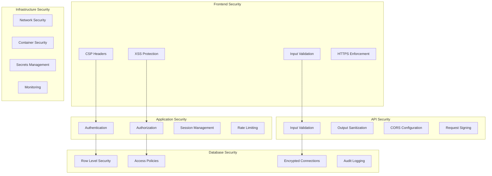

# 🔒 PRISMA Security Guide

Comprehensive security implementation and best practices for the PRISMA AI Portfolio Builder platform.

## 📋 Table of Contents

1. [Overview](#overview)
2. [Security Architecture](#security-architecture)
3. [Authentication & Authorization](#authentication--authorization)
4. [Data Protection](#data-protection)
5. [API Security](#api-security)
6. [Infrastructure Security](#infrastructure-security)
7. [Security Headers](#security-headers)
8. [Vulnerability Management](#vulnerability-management)
9. [Incident Response](#incident-response)
10. [Compliance & Auditing](#compliance--auditing)

## 🎯 Overview

PRISMA implements enterprise-grade security measures to protect user data, prevent unauthorized access, and ensure system integrity. This guide covers all security implementations and best practices.

### Security Principles

- **Defense in Depth**: Multiple layers of security controls
- **Zero Trust Architecture**: Never trust, always verify
- **Principle of Least Privilege**: Minimal required permissions
- **Security by Design**: Security built into every component
- **Continuous Monitoring**: Real-time threat detection and response

### Current Security Status

✅ **Critical Security Measures Implemented**

- Strong authentication with multi-factor options
- Row Level Security (RLS) database protection
- Comprehensive input validation and sanitization
- Security headers and Content Security Policy (CSP)
- Rate limiting and DDoS protection
- Encrypted data transmission (HTTPS/TLS)
- Secure session management

⚠️ **Pending Security Enhancements**

- GitHub token encryption at rest
- Advanced threat detection
- Security audit logging
- Vulnerability scanning automation

## 🏗️ Security Architecture

### Multi-Layer Security Model



### Security Boundaries

1. **Edge Security**: CDN, DDoS protection, geographic filtering
2. **Application Perimeter**: WAF, rate limiting, authentication
3. **Service Mesh**: Inter-service communication security
4. **Data Layer**: Encryption, access controls, audit trails

## 🔐 Authentication & Authorization

### Authentication System

#### Multi-Factor Authentication Support

```typescript
// Supabase Auth Configuration
const supabaseAuthConfig = {
  // Email/Password with complexity requirements
  password: {
    minLength: 12,
    requireUppercase: true,
    requireLowercase: true,
    requireNumbers: true,
    requireSpecialChars: true,
    preventCommonPasswords: true,
    preventReuse: 5, // Last 5 passwords
  },

  // OAuth Providers
  providers: {
    github: {
      scopes: ['read:user', 'user:email', 'repo'],
    },
    google: {
      scopes: ['openid', 'email', 'profile'],
    },
    linkedin: {
      scopes: ['r_liteprofile', 'r_emailaddress'],
    },
  },

  // Session Configuration
  session: {
    refreshTokenRotation: true,
    refreshTokenReuse: false,
    accessTokenLifetime: 900, // 15 minutes
    refreshTokenLifetime: 2592000, // 30 days
    maxConcurrentSessions: 5,
  },
};
```

#### Password Security Implementation

```typescript
// lib/auth/password.ts
import bcrypt from 'bcrypt';
import zxcvbn from 'zxcvbn';

export interface PasswordRequirements {
  minLength: number;
  requireUppercase: boolean;
  requireLowercase: boolean;
  requireNumbers: boolean;
  requireSpecialChars: boolean;
  maxLength: number;
}

export const PASSWORD_REQUIREMENTS: PasswordRequirements = {
  minLength: 12,
  requireUppercase: true,
  requireLowercase: true,
  requireNumbers: true,
  requireSpecialChars: true,
  maxLength: 128,
};

export function validatePassword(password: string): {
  isValid: boolean;
  score: number;
  feedback: string[];
  errors: string[];
} {
  const errors: string[] = [];
  const feedback: string[] = [];

  // Length check
  if (password.length < PASSWORD_REQUIREMENTS.minLength) {
    errors.push(
      `Password must be at least ${PASSWORD_REQUIREMENTS.minLength} characters`
    );
  }

  if (password.length > PASSWORD_REQUIREMENTS.maxLength) {
    errors.push(
      `Password must be no more than ${PASSWORD_REQUIREMENTS.maxLength} characters`
    );
  }

  // Character requirements
  if (PASSWORD_REQUIREMENTS.requireUppercase && !/[A-Z]/.test(password)) {
    errors.push('Password must contain at least one uppercase letter');
  }

  if (PASSWORD_REQUIREMENTS.requireLowercase && !/[a-z]/.test(password)) {
    errors.push('Password must contain at least one lowercase letter');
  }

  if (PASSWORD_REQUIREMENTS.requireNumbers && !/\d/.test(password)) {
    errors.push('Password must contain at least one number');
  }

  if (
    PASSWORD_REQUIREMENTS.requireSpecialChars &&
    !/[!@#$%^&*(),.?":{}|<>]/.test(password)
  ) {
    errors.push('Password must contain at least one special character');
  }

  // Strength analysis using zxcvbn
  const strength = zxcvbn(password);

  if (strength.score < 3) {
    errors.push('Password is too weak');
    feedback.push(...strength.feedback.suggestions);
  }

  return {
    isValid: errors.length === 0,
    score: strength.score,
    feedback,
    errors,
  };
}

export async function hashPassword(password: string): Promise<string> {
  const saltRounds = 12;
  return bcrypt.hash(password, saltRounds);
}

export async function verifyPassword(
  password: string,
  hash: string
): Promise<boolean> {
  return bcrypt.compare(password, hash);
}
```

### Authorization System

#### Role-Based Access Control (RBAC)

```typescript
// lib/auth/roles.ts
export enum UserRole {
  // Customer roles
  CUSTOMER_FREE = 'customer_free',
  CUSTOMER_PRO = 'customer_pro',
  CUSTOMER_BUSINESS = 'customer_business',
  CUSTOMER_ENTERPRISE = 'customer_enterprise',

  // Admin roles (hierarchical)
  ADMIN_VIEWER = 'admin_viewer',
  ADMIN_SUPPORT = 'admin_support',
  ADMIN_MODERATOR = 'admin_moderator',
  ADMIN_MANAGER = 'admin_manager',
  ADMIN_DEVELOPER = 'admin_developer',
  ADMIN_ARCHITECT = 'admin_architect',
}

export enum Permission {
  // Portfolio permissions
  PORTFOLIO_CREATE = 'portfolio:create',
  PORTFOLIO_READ = 'portfolio:read',
  PORTFOLIO_UPDATE = 'portfolio:update',
  PORTFOLIO_DELETE = 'portfolio:delete',
  PORTFOLIO_PUBLISH = 'portfolio:publish',

  // AI permissions
  AI_ENHANCE_BIO = 'ai:enhance_bio',
  AI_OPTIMIZE_PROJECT = 'ai:optimize_project',
  AI_RECOMMEND_TEMPLATE = 'ai:recommend_template',

  // Analytics permissions
  ANALYTICS_READ = 'analytics:read',
  ANALYTICS_EXPORT = 'analytics:export',

  // Admin permissions
  USERS_READ = 'users:read',
  USERS_CREATE = 'users:create',
  USERS_UPDATE = 'users:update',
  USERS_DELETE = 'users:delete',
  USERS_SUSPEND = 'users:suspend',
  USERS_IMPERSONATE = 'users:impersonate',

  // System permissions
  SYSTEM_CONFIGURE = 'system:configure',
  SYSTEM_DEPLOY = 'system:deploy',
  SYSTEM_LOGS = 'system:logs',
}

export const ROLE_PERMISSIONS: Record<UserRole, Permission[]> = {
  [UserRole.CUSTOMER_FREE]: [
    Permission.PORTFOLIO_CREATE,
    Permission.PORTFOLIO_READ,
    Permission.PORTFOLIO_UPDATE,
    Permission.AI_ENHANCE_BIO, // Limited usage
  ],

  [UserRole.CUSTOMER_PRO]: [
    Permission.PORTFOLIO_CREATE,
    Permission.PORTFOLIO_READ,
    Permission.PORTFOLIO_UPDATE,
    Permission.PORTFOLIO_DELETE,
    Permission.PORTFOLIO_PUBLISH,
    Permission.AI_ENHANCE_BIO,
    Permission.AI_OPTIMIZE_PROJECT,
    Permission.AI_RECOMMEND_TEMPLATE,
    Permission.ANALYTICS_READ,
  ],

  // ... additional role definitions

  [UserRole.ADMIN_ARCHITECT]: [
    // All permissions - highest privilege level
    ...Object.values(Permission),
  ],
};

export function hasPermission(
  userRole: UserRole,
  permission: Permission
): boolean {
  return ROLE_PERMISSIONS[userRole]?.includes(permission) ?? false;
}

export function canAccess(
  userRole: UserRole,
  resource: string,
  action: string
): boolean {
  const permission = `${resource}:${action}` as Permission;
  return hasPermission(userRole, permission);
}
```

#### Permission Middleware

```typescript
// lib/auth/middleware.ts
import { NextRequest, NextResponse } from 'next/server';
import { createClient } from '@/lib/supabase/server';

export function withAuth(handler: Function) {
  return async (request: NextRequest, context: any) => {
    try {
      const supabase = createClient();
      const {
        data: { user },
        error,
      } = await supabase.auth.getUser();

      if (error || !user) {
        return NextResponse.json(
          { error: 'Authentication required' },
          { status: 401 }
        );
      }

      // Add user to request context
      (request as any).user = user;
      return handler(request, context);
    } catch (error) {
      return NextResponse.json(
        { error: 'Authentication failed' },
        { status: 401 }
      );
    }
  };
}

export function withPermission(permission: Permission) {
  return function (handler: Function) {
    return withAuth(async (request: NextRequest, context: any) => {
      const user = (request as any).user;

      // Get user role from database
      const userRole = await getUserRole(user.id);

      if (!hasPermission(userRole, permission)) {
        return NextResponse.json(
          { error: 'Insufficient permissions' },
          { status: 403 }
        );
      }

      return handler(request, context);
    });
  };
}
```

## 🛡️ Data Protection

### Encryption Standards

#### Data at Rest

```typescript
// lib/crypto/encryption.ts
import crypto from 'crypto';

const ALGORITHM = 'aes-256-gcm';
const KEY_LENGTH = 32; // 256 bits
const IV_LENGTH = 16; // 128 bits
const TAG_LENGTH = 16; // 128 bits

export class DataEncryption {
  private key: Buffer;

  constructor(secretKey?: string) {
    // Use provided key or generate from environment
    const keySource = secretKey || process.env.ENCRYPTION_KEY;
    if (!keySource) {
      throw new Error('Encryption key not provided');
    }

    this.key = crypto.scryptSync(keySource, 'salt', KEY_LENGTH);
  }

  encrypt(plaintext: string): string {
    const iv = crypto.randomBytes(IV_LENGTH);
    const cipher = crypto.createCipher(ALGORITHM, this.key);
    cipher.setAAD(Buffer.from('prisma-auth-data'));

    let encrypted = cipher.update(plaintext, 'utf8', 'hex');
    encrypted += cipher.final('hex');

    const tag = cipher.getAuthTag();

    // Return: iv + tag + encrypted (all hex encoded)
    return iv.toString('hex') + tag.toString('hex') + encrypted;
  }

  decrypt(encryptedData: string): string {
    const iv = Buffer.from(encryptedData.slice(0, IV_LENGTH * 2), 'hex');
    const tag = Buffer.from(
      encryptedData.slice(IV_LENGTH * 2, (IV_LENGTH + TAG_LENGTH) * 2),
      'hex'
    );
    const encrypted = encryptedData.slice((IV_LENGTH + TAG_LENGTH) * 2);

    const decipher = crypto.createDecipher(ALGORITHM, this.key);
    decipher.setAuthTag(tag);
    decipher.setAAD(Buffer.from('prisma-auth-data'));

    let decrypted = decipher.update(encrypted, 'hex', 'utf8');
    decrypted += decipher.final('utf8');

    return decrypted;
  }
}

// Usage for GitHub tokens
export async function encryptGitHubToken(token: string): Promise<string> {
  const encryption = new DataEncryption();
  return encryption.encrypt(token);
}

export async function decryptGitHubToken(
  encryptedToken: string
): Promise<string> {
  const encryption = new DataEncryption();
  return encryption.decrypt(encryptedToken);
}
```

#### Data in Transit

```typescript
// next.config.js - HTTPS enforcement
const securityHeaders = [
  {
    key: 'Strict-Transport-Security',
    value: 'max-age=31536000; includeSubDomains; preload',
  },
  {
    key: 'X-Content-Type-Options',
    value: 'nosniff',
  },
  {
    key: 'X-Frame-Options',
    value: 'DENY',
  },
  {
    key: 'X-XSS-Protection',
    value: '1; mode=block',
  },
  {
    key: 'Referrer-Policy',
    value: 'strict-origin-when-cross-origin',
  },
];
```

### Personal Data Protection

#### GDPR Compliance Implementation

```typescript
// lib/gdpr/data-protection.ts
export interface PersonalDataRequest {
  userId: string;
  requestType: 'access' | 'portability' | 'deletion' | 'rectification';
  requestDate: Date;
  status: 'pending' | 'processing' | 'completed' | 'rejected';
}

export class GDPRCompliance {
  // Right to Access - Article 15
  async generateDataExport(userId: string): Promise<{
    personalData: any;
    processingActivities: any[];
    dataRetention: any;
  }> {
    const supabase = createClient();

    // Collect all user data
    const [profile, portfolios, analytics, usage] = await Promise.all([
      supabase.from('profiles').select('*').eq('id', userId).single(),
      supabase.from('portfolios').select('*').eq('user_id', userId),
      supabase.from('analytics_events').select('*').eq('user_id', userId),
      supabase.from('usage_stats').select('*').eq('user_id', userId),
    ]);

    return {
      personalData: {
        profile: profile.data,
        portfolios: portfolios.data,
        createdAt: profile.data?.created_at,
        lastLoginAt: profile.data?.last_login_at,
      },
      processingActivities: [
        {
          purpose: 'Portfolio creation and management',
          legalBasis: 'Contract performance',
          dataCategories: ['Profile information', 'Portfolio content'],
          retentionPeriod: '3 years after account deletion',
        },
        {
          purpose: 'Analytics and service improvement',
          legalBasis: 'Legitimate interest',
          dataCategories: ['Usage statistics', 'Performance metrics'],
          retentionPeriod: '2 years',
        },
      ],
      dataRetention: {
        activeAccount: 'Indefinite while account is active',
        deletedAccount: '30 days retention for recovery',
        analytics: '2 years for service improvement',
      },
    };
  }

  // Right to Erasure - Article 17
  async deleteUserData(
    userId: string,
    reason: string
  ): Promise<{
    deletedRecords: number;
    retainedData: string[];
    completionDate: Date;
  }> {
    const supabase = createClient();
    let deletedRecords = 0;
    const retainedData: string[] = [];

    try {
      // Delete in dependency order
      const deleteOperations = [
        { table: 'analytics_events', field: 'user_id' },
        { table: 'github_integrations', field: 'user_id' },
        { table: 'portfolios', field: 'user_id' },
        { table: 'profiles', field: 'id' },
      ];

      for (const operation of deleteOperations) {
        const { count } = await supabase
          .from(operation.table)
          .delete()
          .eq(operation.field, userId);

        deletedRecords += count || 0;
      }

      // Some data might be retained for legal/business reasons
      if (reason !== 'user_request') {
        retainedData.push('Billing records (7 years legal requirement)');
        retainedData.push('Security logs (1 year)');
      }

      return {
        deletedRecords,
        retainedData,
        completionDate: new Date(),
      };
    } catch (error) {
      throw new Error(`Data deletion failed: ${error.message}`);
    }
  }

  // Right to Rectification - Article 16
  async updatePersonalData(userId: string, updates: any): Promise<boolean> {
    const supabase = createClient();

    const { error } = await supabase
      .from('profiles')
      .update({
        ...updates,
        updated_at: new Date().toISOString(),
      })
      .eq('id', userId);

    return !error;
  }
}
```

## 🔒 API Security

### Input Validation & Sanitization

```typescript
// lib/validation/schemas.ts
import { z } from 'zod';
import DOMPurify from 'isomorphic-dompurify';

// Base validation schemas
export const sanitizedString = z.string().transform(str => {
  // Remove potential XSS vectors
  return DOMPurify.sanitize(str, { ALLOWED_TAGS: [] });
});

export const userBioSchema = z.object({
  bio: sanitizedString
    .min(10, 'Bio must be at least 10 characters')
    .max(1000, 'Bio cannot exceed 1000 characters')
    .refine(str => {
      // Check for potential injection attempts
      const suspiciousPatterns = [
        /<script/i,
        /javascript:/i,
        /on\w+=/i,
        /data:text\/html/i,
      ];
      return !suspiciousPatterns.some(pattern => pattern.test(str));
    }, 'Invalid content detected'),

  industry: z.enum([
    'technology',
    'healthcare',
    'finance',
    'education',
    'other',
  ]),
  experienceLevel: z.enum(['junior', 'mid', 'senior', 'executive']),
});

export const portfolioSchema = z.object({
  title: sanitizedString
    .min(1, 'Title is required')
    .max(100, 'Title cannot exceed 100 characters'),

  description: sanitizedString
    .max(500, 'Description cannot exceed 500 characters')
    .optional(),

  templateId: z.string().regex(/^[a-z0-9-]+$/, 'Invalid template ID'),

  content: z.object({
    bio: sanitizedString.max(1000),
    projects: z
      .array(
        z.object({
          title: sanitizedString.max(100),
          description: sanitizedString.max(1000),
          technologies: z.array(sanitizedString.max(50)).max(20),
          imageUrl: z.string().url().optional(),
          projectUrl: z.string().url().optional(),
          githubUrl: z.string().url().optional(),
        })
      )
      .max(20),
    skills: z.array(sanitizedString.max(50)).max(50),
    socialLinks: z
      .object({
        linkedin: z.string().url().optional(),
        github: z.string().url().optional(),
        website: z.string().url().optional(),
        twitter: z.string().url().optional(),
      })
      .optional(),
  }),
});

// Request validation middleware
export function validateRequest<T>(schema: z.ZodSchema<T>) {
  return async (request: Request): Promise<T> => {
    try {
      const body = await request.json();
      return schema.parse(body);
    } catch (error) {
      if (error instanceof z.ZodError) {
        throw new ValidationError('Invalid request data', error.errors);
      }
      throw new ValidationError('Invalid JSON');
    }
  };
}

export class ValidationError extends Error {
  constructor(
    message: string,
    public details?: any
  ) {
    super(message);
    this.name = 'ValidationError';
  }
}
```

### Rate Limiting Implementation

```typescript
// lib/security/rate-limiting.ts
import { Redis } from 'ioredis';

interface RateLimitConfig {
  maxRequests: number;
  windowMs: number;
  keyGenerator?: (request: Request) => string;
  onLimitReached?: (request: Request) => void;
}

export class RateLimiter {
  private redis: Redis;

  constructor() {
    this.redis = new Redis(process.env.REDIS_URL || 'redis://localhost:6379');
  }

  async isLimitExceeded(
    key: string,
    config: RateLimitConfig
  ): Promise<{
    allowed: boolean;
    remaining: number;
    resetTime: number;
  }> {
    const now = Date.now();
    const window = Math.floor(now / config.windowMs);
    const redisKey = `rate_limit:${key}:${window}`;

    const current = await this.redis.incr(redisKey);

    if (current === 1) {
      // First request in this window
      await this.redis.expire(redisKey, Math.ceil(config.windowMs / 1000));
    }

    const remaining = Math.max(0, config.maxRequests - current);
    const resetTime = (window + 1) * config.windowMs;

    return {
      allowed: current <= config.maxRequests,
      remaining,
      resetTime,
    };
  }

  middleware(config: RateLimitConfig) {
    return async (request: Request, response: Response, next: Function) => {
      const key = config.keyGenerator
        ? config.keyGenerator(request)
        : this.getClientIP(request);

      const result = await this.isLimitExceeded(key, config);

      // Set rate limit headers
      response.headers.set('X-RateLimit-Limit', config.maxRequests.toString());
      response.headers.set(
        'X-RateLimit-Remaining',
        result.remaining.toString()
      );
      response.headers.set('X-RateLimit-Reset', result.resetTime.toString());

      if (!result.allowed) {
        if (config.onLimitReached) {
          config.onLimitReached(request);
        }

        return new Response(
          JSON.stringify({
            error: 'Rate limit exceeded',
            retryAfter: Math.ceil((result.resetTime - Date.now()) / 1000),
          }),
          {
            status: 429,
            headers: {
              'Content-Type': 'application/json',
              'Retry-After': Math.ceil(
                (result.resetTime - Date.now()) / 1000
              ).toString(),
            },
          }
        );
      }

      return next();
    };
  }

  private getClientIP(request: Request): string {
    // Try multiple headers for IP detection
    const headers = [
      'x-forwarded-for',
      'x-real-ip',
      'cf-connecting-ip',
      'x-client-ip',
    ];

    for (const header of headers) {
      const value = request.headers.get(header);
      if (value) {
        return value.split(',')[0].trim();
      }
    }

    return 'unknown';
  }
}

// Predefined rate limit configurations
export const rateLimitConfigs = {
  auth: {
    maxRequests: 5,
    windowMs: 15 * 60 * 1000, // 15 minutes
    keyGenerator: (req: Request) =>
      `auth:${req.headers.get('x-forwarded-for') || 'unknown'}`,
  },

  aiApi: {
    maxRequests: 10,
    windowMs: 60 * 1000, // 1 minute
    keyGenerator: (req: Request) =>
      `ai:${req.headers.get('user-id') || 'anonymous'}`,
  },

  portfolioApi: {
    maxRequests: 60,
    windowMs: 60 * 60 * 1000, // 1 hour
    keyGenerator: (req: Request) =>
      `portfolio:${req.headers.get('user-id') || 'anonymous'}`,
  },
};
```

## 🏗️ Infrastructure Security

### Container Security

```dockerfile
# Dockerfile with security best practices
FROM node:18-alpine AS base

# Create non-root user
RUN addgroup --system --gid 1001 nodejs
RUN adduser --system --uid 1001 nextjs

# Security: Remove unnecessary packages
RUN apk del --purge
RUN rm -rf /var/cache/apk/*

# Set up secure working directory
WORKDIR /app
RUN chown nextjs:nodejs /app

# Install dependencies as root, then switch to non-root
FROM base AS deps
RUN apk add --no-cache libc6-compat
COPY package*.json ./
RUN npm ci --only=production && npm cache clean --force

FROM base AS runner
USER nextjs

# Copy application files
COPY --from=deps --chown=nextjs:nodejs /app/node_modules ./node_modules
COPY --chown=nextjs:nodejs . .

# Set security environment variables
ENV NODE_ENV=production
ENV NODE_OPTIONS="--max-old-space-size=1024"

# Expose port
EXPOSE 3000

# Health check
HEALTHCHECK --interval=30s --timeout=3s --start-period=5s --retries=3 \
  CMD curl -f http://localhost:3000/api/health || exit 1

CMD ["npm", "start"]
```

### Secrets Management

```typescript
// lib/config/secrets.ts
import { z } from 'zod';

const secretsSchema = z.object({
  DATABASE_URL: z.string().url(),
  SUPABASE_SERVICE_ROLE_KEY: z.string().min(1),
  HUGGINGFACE_API_KEY: z.string().min(1),
  GITHUB_CLIENT_SECRET: z.string().min(1),
  ENCRYPTION_KEY: z.string().min(32),
  JWT_SECRET: z.string().min(32),
});

export class SecretsManager {
  private secrets: z.infer<typeof secretsSchema>;

  constructor() {
    // Validate all required secrets are present
    this.secrets = secretsSchema.parse({
      DATABASE_URL: process.env.DATABASE_URL,
      SUPABASE_SERVICE_ROLE_KEY: process.env.SUPABASE_SERVICE_ROLE_KEY,
      HUGGINGFACE_API_KEY: process.env.HUGGINGFACE_API_KEY,
      GITHUB_CLIENT_SECRET: process.env.GITHUB_CLIENT_SECRET,
      ENCRYPTION_KEY: process.env.ENCRYPTION_KEY,
      JWT_SECRET: process.env.JWT_SECRET,
    });
  }

  get(key: keyof typeof this.secrets): string {
    return this.secrets[key];
  }

  // Rotate encryption key
  async rotateEncryptionKey(): Promise<void> {
    const newKey = crypto.randomBytes(32).toString('hex');

    // 1. Re-encrypt all sensitive data with new key
    await this.reencryptData(this.secrets.ENCRYPTION_KEY, newKey);

    // 2. Update environment variable
    // This would typically be done through your deployment system

    // 3. Update local instance
    this.secrets.ENCRYPTION_KEY = newKey;
  }

  private async reencryptData(oldKey: string, newKey: string): Promise<void> {
    // Implementation for re-encrypting GitHub tokens and other sensitive data
    // This would query the database and re-encrypt all encrypted fields
  }
}
```

## 🌐 Security Headers

### Content Security Policy (CSP)

```typescript
// lib/security/csp.ts
export const contentSecurityPolicy = {
  development: {
    'default-src': ["'self'"],
    'script-src': ["'self'", "'unsafe-eval'", "'unsafe-inline'"],
    'style-src': ["'self'", "'unsafe-inline'"],
    'img-src': ["'self'", 'data:', 'https:', 'blob:'],
    'font-src': ["'self'", 'data:'],
    'connect-src': [
      "'self'",
      'https://*.supabase.co',
      'wss://*.supabase.co',
      'https://api.huggingface.co',
      'ws://localhost:*',
    ],
    'frame-src': ["'none'"],
    'object-src': ["'none'"],
    'base-uri': ["'self'"],
    'form-action': ["'self'"],
    'frame-ancestors': ["'none'"],
    'upgrade-insecure-requests': [],
  },

  production: {
    'default-src': ["'self'"],
    'script-src': ["'self'", "'nonce-{NONCE}'"],
    'style-src': ["'self'", "'unsafe-inline'"], // Required for Tailwind
    'img-src': ["'self'", 'data:', 'https:', 'blob:'],
    'font-src': ["'self'", 'data:'],
    'connect-src': [
      "'self'",
      'https://*.supabase.co',
      'wss://*.supabase.co',
      'https://api.huggingface.co',
    ],
    'frame-src': ["'none'"],
    'object-src': ["'none'"],
    'base-uri': ["'self'"],
    'form-action': ["'self'"],
    'frame-ancestors': ["'none'"],
    'upgrade-insecure-requests': [],
    'require-trusted-types-for': ["'script'"],
  },
};

export function generateCSPHeader(
  environment: 'development' | 'production'
): string {
  const policy = contentSecurityPolicy[environment];
  const nonce = crypto.randomBytes(16).toString('base64');

  return Object.entries(policy)
    .map(([directive, sources]) => {
      const sourceList = sources
        .map(source => source.replace('{NONCE}', nonce))
        .join(' ');
      return `${directive} ${sourceList}`;
    })
    .join('; ');
}
```

### Security Headers Middleware

```typescript
// middleware.ts
import { NextResponse } from 'next/server';
import type { NextRequest } from 'next/server';

export function middleware(request: NextRequest) {
  const response = NextResponse.next();

  // Security headers
  const securityHeaders = {
    'X-Frame-Options': 'DENY',
    'X-Content-Type-Options': 'nosniff',
    'X-XSS-Protection': '1; mode=block',
    'Referrer-Policy': 'strict-origin-when-cross-origin',
    'Permissions-Policy':
      'camera=(), microphone=(), geolocation=(), payment=()',
    'Strict-Transport-Security': 'max-age=31536000; includeSubDomains; preload',
    'Content-Security-Policy': generateCSPHeader(
      process.env.NODE_ENV === 'production' ? 'production' : 'development'
    ),
  };

  Object.entries(securityHeaders).forEach(([key, value]) => {
    response.headers.set(key, value);
  });

  return response;
}

export const config = {
  matcher: ['/((?!api/|_next/static|_next/image|favicon.ico).*)'],
};
```

## 🔍 Vulnerability Management

### Automated Security Scanning

```yaml
# .github/workflows/security.yml
name: Security Audit

on:
  push:
    branches: [main]
  pull_request:
    branches: [main]
  schedule:
    - cron: '0 2 * * 1' # Weekly on Mondays

jobs:
  security-audit:
    runs-on: ubuntu-latest

    steps:
      - uses: actions/checkout@v3

      - name: Setup Node.js
        uses: actions/setup-node@v3
        with:
          node-version: '18'
          cache: 'pnpm'

      - name: Install dependencies
        run: pnpm install --frozen-lockfile

      - name: Run npm audit
        run: pnpm audit --audit-level moderate

      - name: Run security linting
        run: pnpm eslint . --ext .ts,.tsx --config .eslintrc.security.js

      - name: Check for secrets
        uses: trufflesecurity/trufflehog@main
        with:
          path: ./
          base: main
          head: HEAD

      - name: Container security scan
        uses: anchore/scan-action@v3
        with:
          image: 'prisma-portfolio-builder:latest'
          fail-build: true
          severity-cutoff: high
```

### Security Monitoring

```typescript
// lib/security/monitoring.ts
import { Logger } from '@/lib/logger';

export class SecurityMonitor {
  private logger: Logger;

  constructor() {
    this.logger = new Logger('security');
  }

  // Log authentication events
  logAuthEvent(event: {
    type: 'login' | 'logout' | 'failed_login' | 'password_reset';
    userId?: string;
    ip: string;
    userAgent: string;
    timestamp: Date;
    success: boolean;
    reason?: string;
  }): void {
    this.logger.info('Authentication event', {
      ...event,
      severity: event.success ? 'info' : 'warning',
    });

    // Alert on suspicious activity
    if (event.type === 'failed_login') {
      this.checkFailedLoginPattern(event.ip, event.userAgent);
    }
  }

  // Log authorization events
  logAuthzEvent(event: {
    type: 'permission_denied' | 'role_escalation' | 'admin_action';
    userId: string;
    resource: string;
    action: string;
    ip: string;
    timestamp: Date;
    success: boolean;
  }): void {
    this.logger.warn('Authorization event', event);

    if (event.type === 'permission_denied') {
      this.checkUnauthorizedAccess(event.userId, event.resource);
    }
  }

  // Log data access events
  logDataAccess(event: {
    userId: string;
    resource: string;
    action: 'read' | 'write' | 'delete';
    recordCount: number;
    ip: string;
    timestamp: Date;
  }): void {
    this.logger.info('Data access', event);

    // Alert on bulk data access
    if (event.recordCount > 1000) {
      this.logger.warn('Bulk data access detected', event);
    }
  }

  private async checkFailedLoginPattern(
    ip: string,
    userAgent: string
  ): Promise<void> {
    // Implementation for detecting brute force attacks
    // Check rate of failed logins from same IP
  }

  private async checkUnauthorizedAccess(
    userId: string,
    resource: string
  ): Promise<void> {
    // Implementation for detecting privilege escalation attempts
  }
}
```

## 🚨 Incident Response

### Incident Response Plan

```typescript
// lib/security/incident-response.ts
export enum IncidentSeverity {
  LOW = 'low',
  MEDIUM = 'medium',
  HIGH = 'high',
  CRITICAL = 'critical',
}

export enum IncidentType {
  DATA_BREACH = 'data_breach',
  UNAUTHORIZED_ACCESS = 'unauthorized_access',
  MALWARE = 'malware',
  DDOS = 'ddos',
  SYSTEM_COMPROMISE = 'system_compromise',
  PHISHING = 'phishing',
}

export interface SecurityIncident {
  id: string;
  type: IncidentType;
  severity: IncidentSeverity;
  description: string;
  affectedSystems: string[];
  affectedUsers: string[];
  discoveredAt: Date;
  reportedBy: string;
  status: 'detected' | 'investigating' | 'contained' | 'resolved';
  timeline: IncidentTimelineEntry[];
}

export interface IncidentTimelineEntry {
  timestamp: Date;
  action: string;
  performedBy: string;
  details: string;
}

export class IncidentResponseManager {
  async reportIncident(
    incident: Omit<SecurityIncident, 'id' | 'timeline'>
  ): Promise<string> {
    const incidentId = crypto.randomUUID();

    // 1. Log incident
    await this.logIncident({ ...incident, id: incidentId, timeline: [] });

    // 2. Notify security team
    await this.notifySecurityTeam(incident);

    // 3. Auto-containment for critical incidents
    if (incident.severity === IncidentSeverity.CRITICAL) {
      await this.initiateContainment(incidentId);
    }

    return incidentId;
  }

  private async initiateContainment(incidentId: string): Promise<void> {
    // Immediate containment measures
    await Promise.all([
      this.enableEnhancedMonitoring(),
      this.blockSuspiciousIPs(),
      this.revokeCompromisedSessions(),
      this.alertDevOpsTeam(),
    ]);
  }

  private async notifySecurityTeam(incident: SecurityIncident): Promise<void> {
    // Implementation for alerting security team
    // Email, Slack, PagerDuty, etc.
  }
}
```

### Breach Notification Process

```typescript
// lib/security/breach-notification.ts
export class BreachNotificationManager {
  async assessBreachNotificationRequirements(
    incident: SecurityIncident
  ): Promise<{
    gdprRequired: boolean;
    ccpaRequired: boolean;
    timelineHours: number;
    affectedRecords: number;
    personalDataTypes: string[];
  }> {
    // Assess if breach notification is required under various regulations
    const assessment = {
      gdprRequired: false,
      ccpaRequired: false,
      timelineHours: 72, // GDPR requirement
      affectedRecords: 0,
      personalDataTypes: [],
    };

    // Check if personal data was involved
    if (this.involvesPersonalData(incident)) {
      assessment.gdprRequired = true;
      assessment.personalDataTypes = await this.identifyDataTypes(incident);
    }

    // Check jurisdiction requirements
    if (this.involvesCaliforniaResidents(incident)) {
      assessment.ccpaRequired = true;
    }

    assessment.affectedRecords = await this.countAffectedRecords(incident);

    return assessment;
  }

  async generateBreachNotification(incident: SecurityIncident): Promise<{
    supervisoryAuthority: string;
    userNotification: string;
    publicNotification?: string;
  }> {
    // Generate required breach notifications
    return {
      supervisoryAuthority: this.generateRegulatoryNotification(incident),
      userNotification: this.generateUserNotification(incident),
      publicNotification: this.shouldNotifyPublic(incident)
        ? this.generatePublicNotification(incident)
        : undefined,
    };
  }

  private involvesPersonalData(incident: SecurityIncident): boolean {
    // Check if incident involves personal data
    return incident.affectedSystems.some(system =>
      ['user_profiles', 'portfolios', 'analytics'].includes(system)
    );
  }
}
```

## 📋 Compliance & Auditing

### Audit Logging

```typescript
// lib/audit/audit-logger.ts
export interface AuditEvent {
  timestamp: Date;
  userId?: string;
  sessionId?: string;
  ip: string;
  userAgent: string;
  action: string;
  resource: string;
  resourceId?: string;
  outcome: 'success' | 'failure' | 'error';
  details?: Record<string, any>;
  riskLevel: 'low' | 'medium' | 'high' | 'critical';
}

export class AuditLogger {
  async logEvent(event: AuditEvent): Promise<void> {
    const supabase = createClient();

    await supabase.from('audit_logs').insert({
      timestamp: event.timestamp.toISOString(),
      user_id: event.userId,
      session_id: event.sessionId,
      ip_address: event.ip,
      user_agent: event.userAgent,
      action: event.action,
      resource: event.resource,
      resource_id: event.resourceId,
      outcome: event.outcome,
      details: event.details,
      risk_level: event.riskLevel,
    });

    // High-risk events trigger immediate alerts
    if (event.riskLevel === 'critical') {
      await this.triggerSecurityAlert(event);
    }
  }

  // Audit specific actions
  async logAuthenticationEvent(
    action: 'login' | 'logout' | 'password_change' | 'mfa_enable',
    userId: string,
    outcome: 'success' | 'failure',
    ip: string,
    userAgent: string,
    details?: any
  ): Promise<void> {
    await this.logEvent({
      timestamp: new Date(),
      userId,
      ip,
      userAgent,
      action,
      resource: 'authentication',
      outcome,
      details,
      riskLevel: outcome === 'failure' ? 'medium' : 'low',
    });
  }

  async logDataAccess(
    action: 'read' | 'create' | 'update' | 'delete',
    resource: string,
    resourceId: string,
    userId: string,
    ip: string,
    userAgent: string,
    outcome: 'success' | 'failure'
  ): Promise<void> {
    await this.logEvent({
      timestamp: new Date(),
      userId,
      ip,
      userAgent,
      action,
      resource,
      resourceId,
      outcome,
      riskLevel: action === 'delete' ? 'high' : 'low',
    });
  }

  async logAdminAction(
    action: string,
    targetUserId: string,
    adminUserId: string,
    ip: string,
    userAgent: string,
    details: any
  ): Promise<void> {
    await this.logEvent({
      timestamp: new Date(),
      userId: adminUserId,
      ip,
      userAgent,
      action,
      resource: 'admin_action',
      resourceId: targetUserId,
      outcome: 'success',
      details,
      riskLevel: 'high',
    });
  }
}
```

### Compliance Reports

```typescript
// lib/compliance/reports.ts
export class ComplianceReporter {
  async generateGDPRReport(
    startDate: Date,
    endDate: Date
  ): Promise<{
    dataProcessingActivities: any[];
    dataSubjectRequests: any[];
    breachIncidents: any[];
    consentRecords: any[];
  }> {
    const supabase = createClient();

    const [activities, requests, breaches, consents] = await Promise.all([
      this.getDataProcessingActivities(startDate, endDate),
      this.getDataSubjectRequests(startDate, endDate),
      this.getBreachIncidents(startDate, endDate),
      this.getConsentRecords(startDate, endDate),
    ]);

    return {
      dataProcessingActivities: activities,
      dataSubjectRequests: requests,
      breachIncidents: breaches,
      consentRecords: consents,
    };
  }

  async generateSOC2Report(): Promise<{
    securityControls: any[];
    accessReviews: any[];
    vulnerabilityScans: any[];
    incidentReports: any[];
  }> {
    // Generate SOC 2 Type II compliance report
    return {
      securityControls: await this.assessSecurityControls(),
      accessReviews: await this.getAccessReviews(),
      vulnerabilityScans: await this.getVulnerabilityScans(),
      incidentReports: await this.getIncidentReports(),
    };
  }
}
```

---

This comprehensive security guide covers all critical aspects of PRISMA's security implementation. For additional security questions, see our [Development Guide](./DEVELOPMENT.md) or contact the security team.
